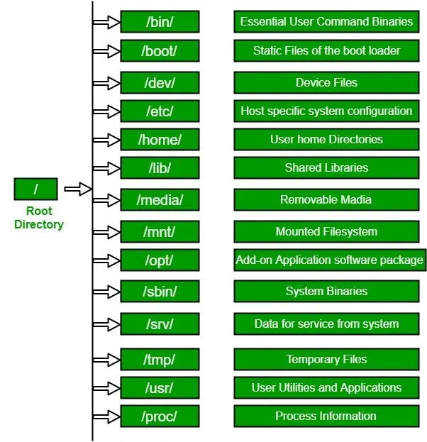
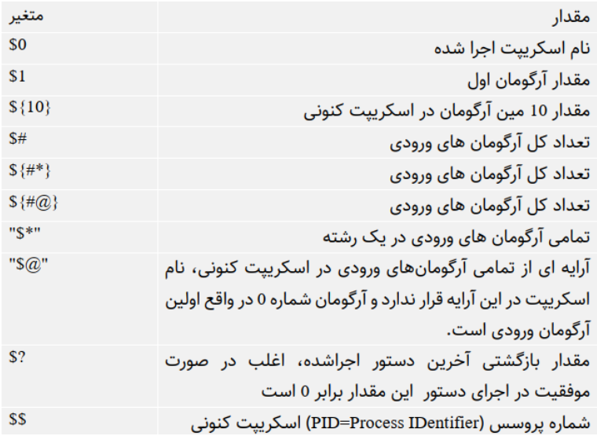
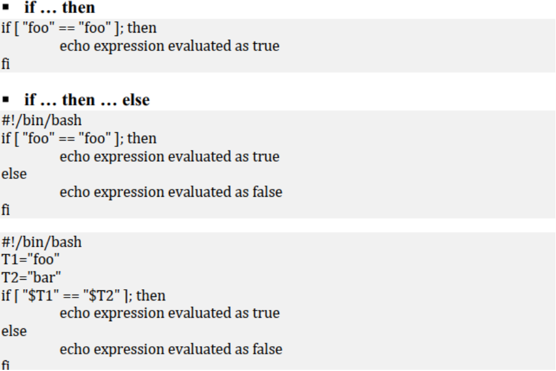
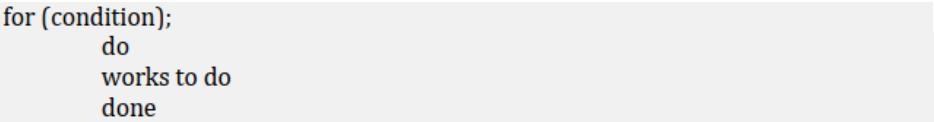

## تاریخچه لینوکس
لینوکس سیستم‌عاملی متن‌باز
(Open Source)
و رایگان است که به ثبات، امنیت و تطبیق‌پذیری بالا شهرت دارد. این سیستم‌عامل در سال 1991 توسط لینوس تروالدز که در آن زمان دانشجوی دانشگاه هلسینکی فنلاند بود ساخته شد. تروالدز در ابتدا این پروژه را به عنوان یک سرگرمی آغاز کرد ولی رفته‌رفته این پروژه رنگ و بوی جدی تر شدن به خود گرفت و تبدیل به یکی از بهترین و پرکاربردترین سیستم‌عامل‌های جهان شد.  
به دلیل متن‌باز بودن این سیستم‌عامل که توسط جامعه اینترنتی مورد استقبال قرار گرفته بود؛ به تدریج توزیع‌های مختلفی از سوی کامیونیتی‌های مختلف برای آن عرضه شد که از جمله آن‌ها می‌توان به اوبونتو
(Ubuntu)،
فدورا
(Fedora)،
دبین
(Debian)
و ... اشاره کرد که هرکدام از آن‌ها ویژگی‌های مخصوص به خود را داشته و از جهاتی بر دیگر توزیع‌ها برتری دارند.
امروزه سیستم‌عامل لینوکس در طیف وسیعی از کاربرد‌ها از رایانه‌های شخصی و سرورها گرفته تا سیستم‌های نهفته
(Embedding Systems)
و تلفن‌های همراه استفاده می‌شود. استفاده گسترده از این سیستم‌عامل در حوزه مهندسی نرم‌افزار باعث می‌شود تا آشنایی با آن از الزامات ورود به دنیای مهندسی نرم‌افزار و مخصوصا دواپس باشد.  
برای آشنایی بیشتر با تاریخچه لینوکس و خود این سیستم‌عامل می‌توانید از
[این لینک](https://linuxbook.ir/chapters/gnulinuxhistory.html)
استفاده کنید.  
## ساختار سلسله مراتبی فایل‌سیستم لینوکس
در سیستم‌عامل لینوکس استاندارد سلسله‌مراتبی فایل‌سیستم
(Filesystem Hierarchy Standard)
ساختار دایرکتوری‌ها را تعیین می‌کند. بدین شکل که فایل‌سیستم را می‌توان به درختی وارونه تشبیه کرد که یک ریشه دارد و تعداد شاخه از آن خارج شده است که هر کدام از شاخه‌ها یک دایرکتوری است که به ذخیره دسته خاصی از اطلاعات و فایل‌ها اختصاص یافته است که به صورت خلاصه در تصویر زیر قابل مشاهده هستند. برای آشنایی بیشتر و عمیق تر با این ساختار می‌توانید از
[این لینک](https://www.geeksforgeeks.org/linux-file-hierarchy-structure/) 
 استفاده کنید.

## ویرایش فایل‌های متنی
در زمان استفاده از یک سیستم‌عامل ممکن است به ایجاد یا تغییر فایل‌های متنی نیاز پیدا کنیم. در این مواقع است که نقش ویرایشگرهای فایل‌های متنی یا
Text Editor
پررنگ تر می‌شود. در سیستم‌عامل لینوکس طیف وسیعی از ویرایشگرهای متن وجود دارد که بر حسب نیاز و سلیقه می‌توانید آن‌ها را انتخاب و از آن‌ها استفاده کنید. از معروف‌ترین ویرایشگر‌های متن موجود برای سیستم‌عامل‌های مبتنی بر لینوکس می‌توان به
Vim
و
Nano
اشاره کرد که به علت پیچیدگی نسبی ویرایشگر
Vim
به توضیح ویرایشگر
Nano
بسنده می‌شود.  
ویرایشگر
nano،
یک ویرایشگر متن رایگان، متن‌باز و مبتنی بر خط فرمان
(Command Line)
است که در ایجاد و ویرایش فایل‌های متنی به ما کمک می‌کند.  
برای آشنایی با نصب، نحوه کار با این ابزار و کلیدهای میانبر آن می‌توانید از 
[این لینک](https://www.hostinger.com/tutorials/how-to-install-and-use-nano-text-editor)
استفاده کنید.

## اسکریپت نویسی
شما با دستورات خط فرمان آشنا شدید و کاربرد‌ها و قابلیت‌های آن‌ها را شناختید. گاهی لازم است تا یک فعالیت تکراری که شامل تعداد زیادی دستور خط فرمان است را برای ورودی‌های مختلف و بر روی ماشین‌های مختلف اجرا کنیم. در این مواقع از قابلیتی به نام اسکریپت نویسی استفاده می‌کنیم. اسکریپت مجموعه‌ای از دستورات خط فرمان است که در یک فایل نوشته شده‌اند و قابلیت اجرا شدن دارند.  
پس از نوشته اسکریپت موردنظر طبیعتا نیاز داریم که آن را اجرا کنیم. برای اجرای یک اسکریپت باید از یکی از پوسته‌های نصب شده در سیستم استفاده کنیم که اولین خط موجود در اسکریپت نیز تعیین کننده پوسته انتخاب شده توسط ماست.

### متغیرها
تعریف و مقداردهی متغیرها همانند تعریف متغیرها در پوسته است.

### آرگومان‌ها
در هر اسکریپت می‌توان از آرگومان‌هایی که هنگام اجرای اسکریپت به آن داده می‌شود استفاده کرد. نکته قابل توجه آن است که متغیر 0 به صورت پیش‌فرض برابر با نام اسکریپت اجرا شده تعریف شده است.

### عبارات شرطی
همانند زبان‌های برنامه‌نویسی در اسکریپت‌نویسی نیز می‌توان از عبارات شرطی استفاده کرد و بنابر شرایط مختلفی که ممکن است در هنگام اجرای یک اسکریپت به وجود بیاید؛ تصمیمات مختلفی گرفت.

### حلقه
علاوه بر عبارات شرطی، حلقه‌ها نیز در اسکریپت‌نویسی قابل استفاده هستند و می‌توانیم برای انجام کارهایی که نیاز به تکرار دارند از آن‌ها استفاده کنیم.

