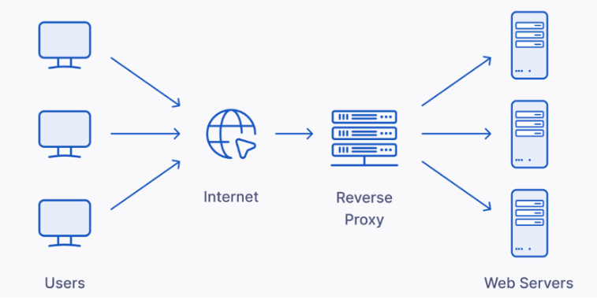

## مقدمه

فرض کنید می‌خواهیم به صورت اولیه یک وب سایت داخل شبکه بارگذاری کنیم تا افراد بتوانند به راحتی با آن ارتباط برقرار کنند و توسط آن یک سری داده متنی، تصویری یا ویدیویی رد و بدل کنند. یکی از بخش های مهم این پروسه استفاده از وب سرورها است.  
وب سرور یک نرم افزار یا سخت افزار کامپیوتری است که از پروتکل
HTTP
و پروتکل های دیگر برای پاسخ به درخواست های مشتری که از طریق وب انجام می شود، استفاده می کند. وظیفه اصلی وب سرور نمایش محتوای وب سایت از طریق ذخیره سازی، پردازش و ارائه صفحات وب به صورت فایل
HTML
همراه با هر نوع داده دیگری مانند تصویر، متن، فایل‌های
CSS
و همچنین جاوا اسکریپت به کاربران است. وب سرورها علاوه بر
HTTP
از
SMTP
و
FTP
نیز پشتیبانی می‌کنند.  

## نحوه کارکرد وب سرور

حال به صورت دقیق‌تر به کارکرد وب سرور می‌پردازیم.  
فرض کنید در خانه نشسته‌اید. طی اتفاقاتی به اطلاعات خاصی از وب‌سایت
example.com
نیاز پیدا می‌کنید. به همین دلیل با وارد کردن
URL
خواسته شده در مرورگر خود، درخواست خود را ادر می‌کنید. در مرحله بعد مرورگر با استفاده از پروتکل
DNS
آدرس
IP
سایت
example.com
را پیدا می‌کند و با این کار، مرورگر به یک وب سرور منتقل می شود. سپس مرورگر با درخواست
HTTP
فایل خاصی را از وب سرور درخواست می کند. وب سرور پاسخ خواهد داد و مجدداً از طریق
HTTP
صفحه درخواستی را برای مرورگر ارسال می کند. اگر صفحه درخواستی وجود نداشته باشد یا مشکلی پیش بیاید، وب سرور با یک پیام خطا پاسخ خواهد داد. سپس مرورگر قادر به نمایش صفحه وب خواهد بود.

## استاتیک در مقابل داینامیک

در این بخش به تقابل وب سرور
Static
در مقابل وب سرور
Dynamic
می‌پردازیم.  
یک وب سرور می‌تواند برای ارائه محتوای ثابت یا پویا استفاده شود. محتوای ثابت به محتوایی اشاره دارد که همانطور که هست نشان داده می شود، در حالی که محتوای پویا را می توان به روز کرد و آن را به صورت شخصی سازی شده تغییر داد. یک وب سرور 
Static
از یک کامپیوتر و نرم‌افزار
HTTP
تشکیل شده است و فایل های میزبانی شده را همانطور که هست به یک مرورگر ارسال می کند. در حالی که در وب سرور پویا از یک وب سرور و سایر نرم افزارها مانند برنامه
Backend
و پایگاه داده استفاده می کنیم تا داده‌ها را به صورت متغیر و شخصی سازی شده به او نشان دهیم.  
برای کسب اطلاعات بیشتر راجع به وب سرور میتوانید به
[این لینک](https://developer.mozilla.org/en-US/docs/Learn/Common_questions/Web_mechanics/What_is_a_web_server)
مراجعه کنید.  
حال فرض کنید وب سایت خود را گسترش داده‌اید و این وب سایت چندین سرویس ارائه می دهد. پس تصمیم می گیرید تا به جای پاسخ دهی به کاربران توسط یک سرور، چندین سرور با وظایف متفاوت ایجاد کنید. از آن جایی که اضافه شدن این سرورها باعث ایجاد پیچیدگی سیستم میشود، علاقمندیم تا همه این سرورها را تا حد توان از دید کاربر پنهان نگه داریم و کاربر صرفا با یک سرور تعامل داشته باشد.

## Reverse Proxy

Reverse Proxy
ابزاری است که تحت عنوان یک سرور مستقل امکانات متعددی را در اختیار ما قرار میدهد تا بتوانیم به نیازهای بیان شده پاسخ دهیم.  
Reverse Proxy
یک مدل معماری شبکه است که در آن یک سرور واسط بین کلاینت و سرور اصلی قرار می‌گیرد. در این مدل، درخواست‌های کلاینت به سرور اصلی ارسال نمی‌شوند، بلکه ابتدا به ریورس پروکسی می‌رسند و سپس ریورس پروکسی مسئول ارسال درخواست به سرور اصلی و دریافت پاسخ آن است.  
به طور خلاصه، فرایند کارکرد یک
Reverse Proxy
به این شکل است:  
فرض کنید یک وب سرور به عنوان
Reverse Proxy
در مقابل چندین وب سرور داخلی با
IP Address
های
192.168.1.02
و
192.168.1.03
و
192.168.1.04
قرار گردفته است.  
* کاربر یک درخواست به آدرس 
example.com
ارسال می‌کند.  
* درخواست به
Reverse Proxy
می‌رسد.  
* Reverse Proxy
بر اساس قوانین تعریف شده، آدرس درخواست را با یکی از آدرس‌های سرورهای داخلی مثل
192.168.1.03
جایگزین می‌کند.  
* درخواست را به سرور مقصد ارسال می‌کند.  
* پاسخ از سرور داخلی دریافت و برای کاربر اراسل می‌شود.  

برای کسب اطلاعات بیشتر راجع به
Reverse Proxy
می‌توانید از
[این لینک](https://liara.ir/blog/%D9%BE%D8%B1%D9%88%DA%A9%D8%B3%DB%8C-%D9%85%D8%B9%DA%A9%D9%88%D8%B3-reverse-proxy-%DA%86%DB%8C%D8%B3%D8%AA%D8%9F/)
استفاده کنید.  



حال فرض کنید این وبسایت راه اندازی شده چندین سرویس مختلف ارائه می‌دهد و هر سرویس بار بسیار زیادی را تحمل میکند. تعداد درخواست‌ها به هر سرور بسیار زیاد شده است و یک سرور نمی‌تواند به همه درخواست‌ها بدرستی و در زمان کوتاه پاسخ دهد. حال این چالش را میتوان به روش‌های مختلفی حل کرد:  
1. اضافه کردن منابع
(CPU
و
RAM
و
Disk
و ...)
سرور که با هزینه زیادی همراه است و
scalable
هم نیست.  
2. اضافه کردن چند سرور با وظایف مشابه و تقسیم بار روی چندین سرور به جای یک سرور که این حالت
scalable
است.


برای انجام روش دوم، با مفهومی به نام
Load balancing
آشنا می شویم.  

## Load Balancing

لود بالانسینگ
یا متعادل‌کردن بار به معنای توزیع یکسان بار یا ترافیک ورودی به یک شبکه، میان گروهی از سرورهای بک‌اند می‌باشد. این عمل توسط یک لود بالانسر
(Load Balancer)
انجام شده و باعث می‌شود تا سرور در ساعات اوج ترافیک دچار کندی و یا اختلال نشود. لود بالانسر میان کلاینت‌ها و سرورها قرار گرفته و به گونه‌ای ترافیک را توزیع می‌کند که بر هیچ‌یک از سرورها فشاری وارد نشود. برای درک بهتر لود بالانسینگ به این مثال توجه کنید. فرض کنید فروشگاهی دارای ۱۰ صندوق است که تنها یکی از آن‌ها کار می‌کند و در چنین شرایطی تمام مشتریان مجبورند در صفی طولانی بایستند و فرد صندوق‌دار نیز باید کار تمام آن‌ها راه بیندازد که این عمل باعث خستگی و کاهش بهره‌وری آن فرد در حین کار می‌شود. حال فرض کنید به‌یکباره تمام صندوق‌ها شروع به کار کرده و تمام مشتریان به صورت مساوی میان آن‌ها تقسیم شوند. در این حالت مشتریان زودتر از فروشگاه خارج شده و صندوق‌دار‌ها نیز دچار خستگی نمی‌شوند. لودبالانسینگ هم دقیقا به همین صورت عمل می‌کند.  
حال شما میتوانید بر اساس نیاز و نوع استفاده از تکنیک‌های متفاوتی برای
Load Balancing
استفاده کنید.

* Round Robin:
در این نوع الگوریتم، ترافیک ورودی به شبکه به صورت زنجیره‌ای و پشت‌سرهم میان سرورها تقسیم می‌شود. این متد اغلب زمانی مورد استفاده قرار می‌گیرد که تمام سرورها دارای مشخصات یکسان باشند.  
* Weighted Round Robin:
نوعی الگوریتم لود بالانسینگ است که در آن شما با توجه به ظرفیت و عملکرد سرورها می‌توانید ترافیک ورودی را میان آن‌ها تقسیم می‌کند. به عنوان مثال می‌توانید بیشتر ترافیک وب‌سایت خود را به سمت سروری که منابع قوی‌تری دارد، ارسال کنید.  
* IP Hash:
در این متد، لود بالانسرها محاسبات ریاضی به نام
Hashing
را بر روی آدرس‌های
IP
انجام داده و بر اساس عدد بدست آمده، ترافیک آن‌ها را به سمت سرورهای مناسب هدایت می‌کنند. با استفاده از این روش می‌توانید مطمئن شوید که درخواست‌های یک
IP
هر بار تنها به سمت یک سرور خاص می‌روند.  
* Weighted Least Connection:
در این الگوریتم، تعداد درخواست‌های ارسالی به هر سرور بر اساس میزان عملکرد و ظرفیت مشخص می‌شود و بنابراین سرورهای قدرتمندتر نسبت به سایر سرورها باید تعداد اتصالات بیشتری داشته باشند.  

برای آشنایی بیشتر با مفهوم لود بالانسینگ می‌توانید به
[این لینک](https://samwho.dev/load-balancing/)
مراجعه کنید.

حال پس از آشنا شدن با کلیدواژه‌های
Web Server
،
Reverse Proxy
و همچنین
Load Balancing
به سراغ ابزاری می‌رویم که همه این امکانات را برای ما فراهم می‌کند.  

## Nginx

Nginx
یک وب سرور با عملکرد بالا است که علاوه بر این، به عنوان یک پروکسی معکوس، پروکسی ایمیل، لود بالانسر و پروکسی عمومی
TCP/UDP
این سیستم برای اولین بار توسط ایگور سیسوئف توسعه یافت و در سال ۲۰۰۴ به صورت عمومی منتشر شد. 
Nginx
به خاطر ثبات، مجموعه ویژگی‌های غنی، پیکربندی ساده و مصرف کم منابع شناخته شده است.  
در اینجا به تفصیل به ویژگی‌ها و قابلیت‌های کلیدی آن می‌پردازیم:  
1. وب سرور:
Nginx
برای ارائه محتوای استاتیک به صورت سریع و کارآمد استفاده می‌شود. همچنین می‌توان از آن به عنوان وب سرور برای محتوای داینامیک نیز استفاده کرد، اگرچه این قابلیت معمولاً شامل واگذاری جنبه‌های داینامیک به یک سرور برنامه پشت
Nginx
است که به عنوان یک پروکسی معکوس استفاده می‌شود.  
2. Reverse Proxy: Nginx،
می‌تواند ترافیک ورودی را بین چندین سرور پشتی توزیع کند، پاسخ‌ها را کش کند، و بهبود امنیت و عملکرد را فراهم کند. این برای تعادل بار بین چندین سرور برنامه یا برای کش کردن سایت‌های کند مبتنی بر پایگاه داده مورد استفاده قرار می‌گیرد.  
3. توزیع بار:
سیستم توزیع بار
Nginx
می‌تواند درخواست مشتریان را بر اساس
IP،
URL
و دیگر خصوصیات توزیع کند و از هر دو خصوصیت
Active/Passive Healh Check
پشتیبانی می‌کند تا اطمینان حاصل شود ترافیک فقط به سرورهای سالم هدایت می‌شود.  
4. کش
Nginx:
HTTP
می‌تواند پاسخ‌ها را در کش ذخیره و بازیابی کند تا بار روی سرورهای برنامه را کاهش دهد و زمان پاسخ را سرعت ببخشد.  
5. فشرده‌سازی محتوا:
Nginx،
از فشرده‌سازی محتوا با استفاده از
gzip
پشتیبانی می‌کند تا مقدار داده‌هایی که باید از طریق شبکه ارسال شود را کاهش دهد.  
6. انعطاف‌پذیری در پیکربندی: فایل پیکربندی
Nginx
هم ساده و هم قدرتمند است، که امکان تغییر مسیر آسان، بازنویسی
URL
ها و بسیاری موارد دیگر را فراهم می‌کند.  
7. همزمانی
(Concurrency):
ابزار
Nginx
با معماری رویداد محور
(event-driven architecture)
خود، تعداد زیادی اتصال همزمان را بسیار کارآمد مدیریت می‌کند. این امر باعث سهولت هرچه بیشتر پاسخ دهی به درخواست کاربران می‌شود.

## تمرین
در این مرحله قصد داریم تا با پیاده‌سازی یک مثال عملی از کانفیگ کردن
Nginx
بیشتر با بخش‌های مختلف آن آشنا شویم. برای این کار در قدم اول نیاز است تا
Nginx
را بر روی سیستم خود نصب کنید. برای نصب گزینه‌های متعددی پیش روی خود دارید که پیشنهاد ما استفاده از داکر است.
پس از نصب وارد آدرس زیر شوید و فایل کانفیگ را با یک ویرایشگر متن باز کنید.

``` bash
sudo nano /etc/nginx/nginx.conf
```

پس از بازکردن فایل با ویرایشگر متن درون بلاک 
http
یک بلاک
server
به شکل زیر اضافه کنید.

``` nginx
http {
    # Existing configurations...

    server {
        listen 80;
        server_name mywebsite.com;

        location / {
            root /usr/share/nginx/html/mywebsite;
            index index.html;
        }

        error_page 404 /404.html;
        location = /404.html {
            root /usr/share/nginx/html/mywebsite;
        }
    }
}
```

بخش‌های مختلف کانفیگ فعلی به شرح زیر خواهند بود:  

* server:
یک بلاک سرور تعریف می‌کند.  
* listen 80:
سرور را برای گوش کردن ترافیک ورودی در پورت 80 تنظیم می‌کند.
* server_name mywebsite.com: 
نام دامنه را برای سرور مشخص می‌کند که مقدار آن برابر با
mywebsite.com
خواهد بود.
* {...}/location:
  * root/usr/share/nginx/html/mywebiste:
    پوشه
    root
    را تعیین می‌کند. این پوشه محل ذخیره شدن فایل‌هاست.
  * index index.html:
    فایل
    index
    پیشفرض را مشخص می‌کند.
* error_page 404 /404.html:
صفحه دلخواهی را برای خطای
404
مشخص می‌کند.
* {...}/location = /404.html:
مکان صفحه 404 دلخواه را مشخص می‌کند.  

در مرحله بعدی نوبت به ساخت دایرکتوری موردنیاز برای قرار دادن فایل‌های
static
پروژه می‌رسد. با استفاده از دستورات زیر ساختار دایرکتوری را ایجاد کنید. و با استفاده از یک ویرایشگر متن یک فایل
HTML
در محل مشخص شده ایجاد کنید.  

``` bash
sudo mkdir -p /usr/share/nginx/html/mywebsite
sudo nano /usr/share/nginx/html/mywebsite/index.html
```

محتویات دلخواهی درون فایل

``` filename
index.html
```

قرار دهید. برای راحتی کار می‌توانید از کد زیر استفاده کنید.  

``` html
<!DOCTYPE html>
<html>
<head>
    <title>Welcome to CodeStar!</title>
</head>
<body>
    <h1>Hello, World!</h1>
    <p>This is a simple static website served by Nginx.</p>
</body>
</html>
```

حال نیاز است تا برای صفحه 404 هم یک فایل در مسیر تعریف شده داخل کانفیگ بسازیم. برای این کار از دستور زیر استفاده کنید.  

``` bash
sudo nano /usr/share/nginx/html/mywebsite/404.html
```

برای محتوای آن هم می‌توانید از کد
html
زیر استفاده کنید.  

``` html
<!DOCTYPE html>
<html>
<head>
    <title>Page Not Found</title>
</head>
<body>
    <h1>404 - Page Not Found</h1>
    <p>Sorry, the page you are looking for does not exist.</p>
</body>
</html>
```

بعد از انجام دادن مراحل بالا، دستور زیر را برای بررسی خطاهای سینتکسی احتمالی در فایل کانفیگ اجرا کنید.  

``` bash
sudo nginx -t
```

اگر نتایج تست موفقیت آمیز بود. وب سرور شما آماده شروع به کار است. در محیط لینوکس با دستور زیر می‌توانید آن را
start
کنید.  

``` bash
sudo systemctl restart nginx
```

وبسایتی که پیاده‌سازی کردید در آدرس زیر قابل دسترسی است. با وارد کردن آن در آدرس بار مرورگر خود نتیجه کارتان را مشاهده کنید.  

``` address
http://{place your web server's IP addrss here}
```
