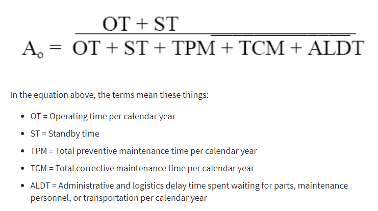
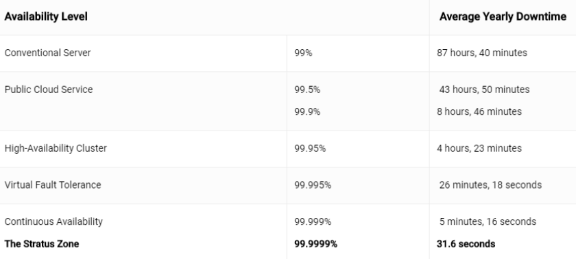

## مقدمه
پس از شناسایی یک نیاز، طراحی و توسعه یک سیستم برای رفع آن نیاز به صورت کلی مسئله ما را حل نمی‌کند بلکه سیستم طراحی شده باید در اکثر اوقات و حتی در شرایط بد و پیش آمدن رخدادهای غیرمنتظره هم به درستی کار کند و در دسترس باشد. به همین دلیل است که مفهوم
High Availability
مفهومی بسیار مهم است که قصد داریم در این بخش با آن بیشتر آشنا شویم.  
برای افزایش
Availablity
یک سیستم راهکارهای زیادی وجود دارند که تعدادی از مهم‌ترین آن‌ها در قالب یک مثال در این بخش ذکر شده اند.
تصور کنید شما به تازگی در یک شرکت بزرگ استخدام شده‌اید. این شرکت پلفترمی را به مشتریان خود ارائه می‌دهد که در بررسی و تحلیل داده‌های مختلف مورد استفاده قرار می‌گیرد. مشتریان شما شرکت‌ها و سازمان‌هایی هستند که با داده‌های حساس و حجیم سروکار دارند. از این رو قابل اعتماد بودن محصول شما و عملکرد درست آن در شرایط مختلف برای آن‌ها بسیار حائز اهمیت است. مسئولیت شما در این شرکت استقرار محصولات شرکت، برای مشتریان آن است. در سناریو ذکر شده چه راهکارهایی برای افزایش فاکتور
Availablity
در محصولات مستقر شده به نظرتان می‌رسد؟
احتمالا با مطالعه نکات بالا به اهمیت مفهوم
Availablity
پی برده‌اید. این مفهوم توسط معیار زیر اندازه گیری می‌شود:

با توجه به فرمول ذکر شده می‌توان بی‌نهایت سطح
Availablity
داشت. اما یک روش رایج تقسیم‌بندی این سطوح به پنج دسته است که با عنوان
The Five Nines
شناخته می‌شوند. در تصویر زیر این پنج سطح با یکدیگر مقایسه شده‌اند.

برای آشنایی بیشتر با مفهوم 
The Five Nines
می‌توانید از
[این لینک](https://www.cbtnuggets.com/blog/certifications/cloud/the-five-nines-how-to-measure-high-availability-uptime)
استفاده کنید.

حال که اهمیت مفهوم
High Availablity
را بهتر درک کردید. وقت آن است که با تعدادی از راهکارهای افزایش این فاکتور آشنا شویم.
از رایج‌ترین راهکارهای موجود می‌توان به موراد زیر اشاره کرد:  

### Load Balancing
این فرایند به منظور توزیع ترافیک شبکه بین چندین سرور یا منبع محاسباتی انجام می‌شود. این کار باعث می‌شود که هیچ یک از سرورها بیش از حد بارگذاری نشوند و سیستم به صورت بهینه عمل کند.
استفاده از این مفهوم مزایای زیر را در پی دارد:  
* افزایش عملکرد و سرعت پاسخ‌دهی سیستم.
* جلوگیری از بارگذاری بیش از حد یک سرور و در نتیجه کاهش احتمال خرابی. 
* بهبود دسترسی به سرویس‌ها و افزایش ظرفیت سیستم برای پاسخگویی به تعداد بیشتری از کاربران.

### Redundancy
مفهوم
Redundancy
یا افزونگی به معنای داشتن منابع اضافی یا پشتیبان است که در صورت خرابی منابع اصلی، بتوانند به عنوان جایگزین عمل کنند. که باعث افزایش قابلیت اطمینان و پایداری سیستم، کاهش زمان خرابی
(Down Time)
با استفاده از منابع پشتیبان و همچنین فراهم کردن توانایی بازیابی سریع و جلوگیری از از دست رفتن داده‌ها یا خدمات می‌شود.  

### Automatic Failover
فرایندی است که طی آن، به محض شناسایی خرابی در یک سیستم یا سرور، سیستم پشتیبان به صورت خودکار وارد عمل می‌شود و مسئولیت را بر عهده می‌گیرد. با اهمیت دادن به این مفهوم زمان خرابی‌ها به حداقل ممکن می‌رسد، اعتماد کاربران به سیستم افزایش می‌یابد و نیاز به مداخله دستی برای حل مشکلات سیستم نیز کاهش می‌یابد.  

### Single Point of Failure (SPoF)
در تعریف ساده نقطه شکست تکین به معنای یک جزء یا یک بخش از سیستم است که در صورت خرابی آن، کل سیستم دچار مشکل خواهد شد. شناسایی و حذف
SPoF
ها به افزایش پایداری سیستم کمک می‌کند. همچنین در طراحی و معماری سیستم باید به گونه‌ای باشد که هر جزئ دارای پشتیبان باشد تا از وقوع خرابی‌های بزرگ جلوگیری شود. برای آشنایی بیشتر با مفهوم
FailOver
می‌توانید از
[این لینک](https://www.techtarget.com/searchstorage/definition/failover)
استفاده کنید.

### Observability
قابلیت مشاهده پذیری یکی دیگر از مفاهیمی می‌باشد که توجه به آن ما را قادر می‌سازد تا وضعیت داخلی یک سیستم را درک و اندازه‌گیری کنیم. اهمیت دادن به این مفهوم باعث می‌شود تا مشکلات را به راحتی تشخصی داده و شروع به برطرف کردن آن‌ها کنیم، عملکرد سیستم را بهبود بخشیم و حتی وقوع خرابی‌ها را در آینده پیش‌بینی کنیم و از رخ دادن آن‌ها جلوگیری کنیم.  

## Disaster Recovery (DR)
یکی از مفاهیم مرتبط و گره‌خورده با مفهوم
High Availability
مفهوم
Disaster Recovery
می‌باشد.  این مفهوم به فرایند بازگرداندن حالت کلی یک سیستم پس از رخ دادن یک حادثه اشاره می‌کند و راه‌حل‌های مختلفی برای آن ارائه می‌دهد. از جمله این راهکارها می‌توان به موارد زیر اشاره کرد:  

* پشتیبان گیری منظم و مستمر از پایگاه‌های داده  
* استقرار سرورها در نقاط جغرافیایی مختلف
* مانیتورینگ و استفاده از سیستم‌های هشدار در هنگام بروز مشکلات مختلف
* استفاده از مفهوم
Containerization
و ابزارهایی مانند 
Docker
و
Kubernetes  

پس از استفاده از راهکارهای معرفی شده جهت افزایش فاکتور
High Availability
و پیاده‌سازی سازوکارهای
Disaster Recovery
در سیستم، نیاز داریم تا میزان موثر بودن این راهکارها را بررسی کنیم. برای این کار روش‌های مختلفی وجود دارند که در این بخش به تفکیک برای هر موضوع تعدادی از این روش‌ها را معرفی می‌کنیم.  
برای بررسی
High Availability
در یک سیستم می‌توانیم از آزمون‌های زیر استفاده کنیم:  

* Failover Testing (برای آشنایی بیشتر از
[این لینک](https://www.tutorialspoint.com/software_testing_dictionary/failover_testing.htm)
استفاده کنید.)
* Load Testing (برای آشنایی بیشتر از
[این لینک](https://www.tutorialspoint.com/software_testing_dictionary/load_testing.htm)
استفاده کنید.)
* Graceful Degradation Testing (برای آشنایی بیشتر از
[این لینک](https://www.techtarget.com/searchnetworking/definition/graceful-degradation#:~:text=Graceful%20degradation%20is%20the%20ability,is%20to%20prevent%20catastrophic%20failure.)
استفاده کنید.)

همچنین برای بررسی
Disaster Recovery 
در یک سیستم می‌توانیم از روش‌های زیر استفاده کنیم: 
* Partial/Full Failover Testing
* A/B Testing (برای آشنایی بیشتر از
[این لینک](https://www.oracle.com/cx/marketing/what-is-ab-testing/)
استفاده کنید.)
* Network Partition Testing (در این مورد خطاهای یک شبکه با هدف بررسی عملکرد بخش‌های مختلف یک سیستم در حالتی که نمی‌توانند به درستی با بقیه اجزای آن ارتباط برقرار کنند بررسی می‌شود.)
* Chaos Engineering (برای آشنایی بیشتر از
[این لینک](https://www.opentext.com/what-is/chaos-engineering#:~:text=Chaos%20engineering%20is%20the%20practice,actual%20outage%20or%20other%20disruption.)
استفاده کنید.)

و در نهایت می‌توانیم از مفهوم
Post Disaster Validation
برای بررسی کیفیت راهکارهای
Disaster Recovery
خودمان استفاده کنیم. این مفهوم بررسی می‌کند که آیا پس از رخ دادن یک حادثه و برگشتن به حالت عادی همچنان تمام بخش‌های سیستم قابل استفاده هستند و همچنین هیچ داده‌ای از بین نرفته باشد.  
برای بررسی میزان
High Availablity
در یک سیستم نیز می‌توان از معیارهایی نظیر
Mean Time Between Failures (MTBF)
و
Mean Time to Repair (MTTR)
استفاده کرد.  
### MTTR
به معنای متوسط زمان لازم برای تعمیر یک سیستم یا تجهیز پس از وقوع خرابی است. این معیار بیانگر مدت زمانی است که برای تشخیص، تعمیر و بازگرداندن سیستم به حالت عادی نیاز است و مقدار آن از تقسیم
Downtime
کل بر تعداد خرابی‌ها به دست می‌آید.  
### MTBF  
به معنای متوسط زمان بین دو خرابی متوالی یک سیستم یا تجهیز است. این معیار نشان‌دهنده قابلیت اطمینان سیستم و مدت زمان متوسطی است که سیستم بدون خرابی کار می‌کند و مقدار آن از تقسیم زمان عملکرد سیستم
(Total Operating Time)
بر تعداد خرابی‌ها به دست می‌آید.  