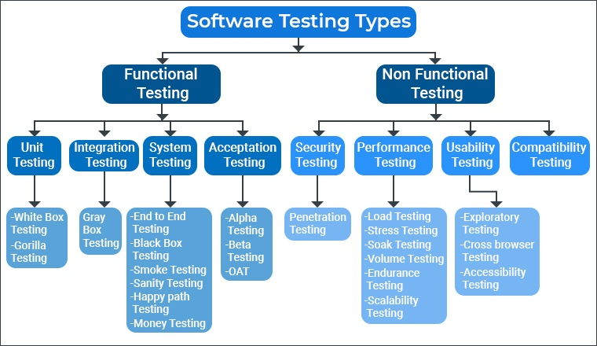

تست نرم افزار یکی از فرایندهای اصلی و مهم در توسعه نرم افزار است. در چرخه (SDLC (Software Development Life Cycle، فرایند تست پس از پیاده‌سازی یک بخش از نرم افزار قرار میگیرد. در این بخش با روش‌های گوناگون سعی می‌کنیم تا مطمئن شویم نرم افزار بدرستی کار میکند. در این فصل ابتدا با لزوم وجود تست در انواع و سطوح مختلف توسعه نرم افزار رو به رو میشویم و پس از آن با انواع روش‌های اعمال تست آشنا می‌شویم.

در بخش اول با این سوال مواجه میشویم. چرا باید نرم افزار را تست کنیم؟ آیا دستی تست کردن نرم افزار کفایت نمی‌کند؟ این سوالات و برخی سوالات دیگر، پرسش‌هایی است که در این بخش به آن‌ها میپردازیم.

نرم افزار یک موجود زنده است و مدام در حال توسعه است. این توسعه‌ها باعث ایجاد کامپوننت‌های بزرگ با پیچیدگی‌های زیادی میشود. تغییر داخل یکی از این کامپوننت‌ها ممکن است به چندین بخش سامانه آسیب برساند و چندین باگ بزرگ و کوچک ایجاد کند. طبق یکی از اصول مهم نرم افزار، هیچ نرم افزار بدون باگی وجود ندارد و کشف نکردن باگ‌ها به معنی بدون باگ بودن نرم افزار نیست ولی نیاز داریم تا با تست درست سامانه و کشف هرچه بیشتر باگ‌ها از پدید آمدن آن‌ها تا حد توان جلوگیری کنیم.

در این بخش با چند مورد از مهمترین رویکردهای تست آشنا میشویم:

- تست دود (Smoke testing): در این رویکرد، کارکرد کلی محصول، رفتار و functionality های اولیه و بسیار مهم محصول تست میشود به گونه‌ای که با fail شدن تست‌ها میتوان گفت محصول به باگ‌هایی با اولویت بسیار بالا برخورده است.
- تست رگرسیون (Regression testing): فرض کنید بخشی از یک کامپوننت درون نرم افزار دستخوش تغییر میشود. این تغییرات ممکن است چندین جای سامانه را هدف گیرد و آن‌ها را تغییر دهد. تست رگرسیون نوعی تست نرم افزاری است که پس از به روز رسانی کد انجام می شود تا اطمینان حاصل شود که به روزرسانی کد هیچ باگ جدیدی ایجاد نکرده است. این امر به این دلیل است که کد جدید ممکن است منطق جدیدی وارد کند که با کد موجود در تضاد باشد و منجر به ایجاد باگ شود.

چندین رویکرد مهم دیگر نیز مثل Acceptance testing یا Sanity testing و … نیز وجود دارند که میتوانید آن‌ها را مطالعه کنید.

Functional testing: این تست‌ها کارکرد عملی و کاربردی نرم افزار را هدف می‌گیرند. این نوع تست به چندین زیر نوع تقسیم میشود که در ادامه به توضیح آن‌ها میپردازیم.

Unit testing: Unit testing یک مرحله از تست نرم افزار است که در آن بخش‌های کوچک از یک برنامه (Units) یا کامپوننت‌های مختلف یک نرم افزار تست می‌شوند. منظور از بخش کوچک یک برنامه، کلاس‌ها و توابع است. برنامه نویسان از Unit Test استفاده می‌کنند تا از صحت و درستی کد خود اطمینان کسب کنند. این تست به صورت white box انجام میشود. تست white box به تست‌هایی می‌گویند که توسعه دهنده در آن به سورس کد برنامه دسترسی دارد.

Integration testing: شاید در نگاه اول و از دید فردی که در حوزه‌ی نرم‌افزارهای Enterprise تجربه‌ای نداشته است،‌ اگر هر کدام از ماژول‌ها یا بخش‌های نرم‌افزار، به تنهایی خوب و درست کار کنند؛ قاعدتا در صورتی که وارد سیستم شوند و با ماژول‌های دیگر در رابطه باشند هم درست کار میکنند و مشکلی پیش نخواهد آمد. اما در واقعیت اینطور نیست! بلکه وصل کردن ماژول‌های مختلف یک سیستم نرم‌افزاری به یکدیگر، به خودیِ خود یکی از پرچالش‌ترین مسائل در طراحی نرم‌افزار است. تست یکپارچه‌سازی یک تست نرم‌افزاری است که در آن ماژول‌های نرم‌افزاری منحصر به فرد به عنوان یک گروه ترکیب و آزمایش می‌شوند. این تست برای ارزیابی انطباق یک سیستم یا یک جزء(component) با نیازمندی‌های عملکردی مشخص انجام میشود. تست یکپارچه سازی، پس از تست واحد(Unit testing) و قبل از تست کل سیستم(System testing) انجام می‌شود. تست یکپارچه سازی ماژول‌هایی را که روی آنها تست واحد(Unit testing) انجام شده‌ است را به عنوان ورودی می‌گیرد و آن‌ها را در گروه‌های بزرگتری دسته‌بندی می‌کند و تست‌های تعریف شده را روی آن گروه‌ها انجام می‌دهد. خروجی آن، سیستم یکپارچه شده‌ است که آماده برای تست سیستم(System testing) است. این تست به صورت gray box انجام میشود.

Acceptance testing: تست پذیرش روشی در تست نرم افزار است که در آن، یک سیستم برای پذیرش، آزموده یا بررسی می‌شود. این تست، تطبیق سیستم را با requirements، ارزیابی و بررسی می‌کند که آیا برای آماده تحویل به مشتری است یا خیر. تست پذیرش آخرین مرحله تست نرم افزار است که پس از تست سیستم و پیش از ایجاد سیستم برای مصارف عمومی انجام می‌شود و به صورت black box انجام میشود. تست black box به تست‌هایی می‌گویند که توسعه دهنده در آن به سورس کد برنامه دسترسی ندارد و صرفا به نحوه کارکرد برنامه، flow های آن و برخی نمودارهای آن مثل UML و … دسترسی دارد.

انواع مختلف دیگری از انواع تست نیز وجود دارند که هریک جنبه خاصی از نرم افزار را مورد بررسی قرار میدهند و بر اساس نیاز محصول و بودجه مورد نظر میتوانند روی محصول اعمال شوند.

یکی از مهمترین موضوعاتی که باید به آن دقت کنیم حرکت از سمت تست دستی به سمت تست خودکار است. در موارد بسیار کمی به دلیل زیاد بودن هزینه نسبت به سود بدست آمده، باید از همان تست دستی استفاده کنیم چون خودکار کردن برخی روال‌ها هزینه بسیار زیادی را به ما متحمل میکند. اما این تست‌ها، بخش بسیار ناچیزی از فرایند ما را شامل میشوند.

در هر بروزرسانی کد محصول، باید از کیفیت آن مطمئن شویم. همچنین از خراب نشدن قسمت‌های قبلی و منطق‌های پیشین کد اطمینان حاصل کنیم. به همین دلیل باید علاوه بر کد جدید از صحت و خراب نشدن کدهای قدیمی نیز اطمینان حاصل کنیم. با توجه افزایش هر روز حجم کد، تست کردن دستی محصول طبیعتا امری غیر ممکن و طاقت فرسا میشود. بنابراین با حرکت به سمت تست خودکار و انجام آن‌ها در زمان‌های دلخواه و مناسب میتوانیم باعث افزایش کیفیت محصول و همچنین کاهش زمان تست شویم.

در نتیجه باید در جهت افزایش تست خودکار محصول و جلوگیری از تست‌های دستی تا حد توان بکوشیم و به بلوغ و کیفیت محصول کمک کنیم.
