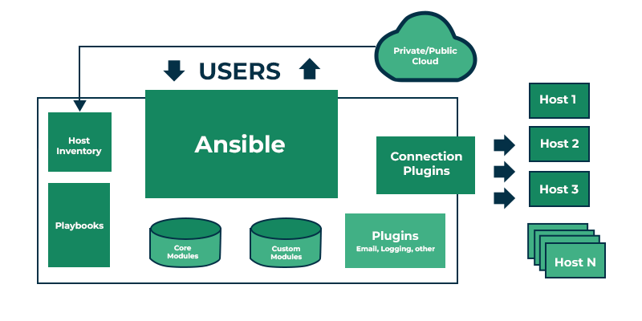

## مقدمه
فرض کنید به عنوان مسئول دوآپس یک تیم نرم‌افزاری مشغول به کار شده‌اید. به عنوان اولین وظیفه از شما خواسته شده تا سرورهای مختلف شرکت را بررسی کنید و در صورت نیاز نرم‌افزارهای نصب شده روی آن‌ها را بروزرسانی کنید. با بررسی شرایط و وضعیت سرورها می‌فهمید که تعداد آن‌ها کم نیست و مدت‌هاست که کسی آن‌ها را بروزرسانی نکرده است. در این شرایط ممکن است وظیفه محول شده را بسیار سخت و زمان‌بر ببینید اما این در شرایطی است که با ابزاری به نام
Ansible
آشنا نباشید.  
Ansible
ابزاری متن‌باز است که با عنوان
Automation and Orchestration tool
شناخته می‌شود. این ابزار محبوب برای اتوماتیک کردن فرایند‌هایی مانند پیکربندی سیستم‌ها، فرآیندهایی مانند بروزرسانی، نظارت و پشتیبان‌گیری، مدیریت زیرساخت‌ها، استقرار، هماهنگ سازی
(Orchestration)
و بحث‌های مربوط به امنیت مانند اعمال پالیسی‌های مختلف و اطمینان از انطباق با استاندارد‌های امنیتی و یا بررسی و اصلاح آسیب‌پذیری‌ها و اجرای اسکریپت‌های امنیتی کاربرد دارد.
از مهم‌ترین دلایل محبوبیت زیاد این ابزار می‌توان به موارد زیر اشاره کرد:  

* نصب و استفاده راحت
* رایگان و متن‌باز بودن
* نرم‌افزاری سبک و قابل اتکا
* بسیار امن از جهت استفاده از قابلیت‌های امنیتی OpenSSH

Ansible
یک ابزار
Agent-less
است. به این معنا که شما برای استفاده از آن نیازی ندارید که آن را روی تک تک
Node
هایی که دارید نصب کنید.
Ansible
این ویژگی را مدیون استفاده از
SSH
است. این ابزار برای انجام فرایندهای مشخص شده از
SSH
برای متصل شدن به
Node
های خواسته شده استفاده می‌کند و پس از متصل شدن وظایف مشخص شده خود را که در قالب
Task
هایی در
Playbook
مشخص شده‌اند را انجام می‌دهد.  
برای استفاده از
Ansible
به دانش برنامه‌نویسی خاصی نیاز ندارید و
Playbook
های این ابزار تقریبا مانند زبان انگلیسی اما در قالب فرمتی خاص نوشته می‌شوند که در ادامه با آن آشنا می‌شوید. خود ابزار نیز با استفاده از زبان
Python
توسعه داده شده که بسیار قابل فهم است و این موضوع قابلیت مشارکت در توسعه آن و حتی شخصی سازی را نیز برای شما فراهم می‌کند.  

## معماری Ansible  

ساختار
Ansible
از بخش‌های متفاوتی تشکیل شده‌است که شامل موارد زیر می‌شوند:  

* Control Node: دستورات و
Playbook
ها با استفاده از فراخوانی فایل اجرایی
Ansible
در
Control Node
ها اجرا می‌شوند. شما عملا می‌توانید از هر کامپیوتری که روی آن
Python
نصب شده است به عنوان یک
Control Node
استفاده کنید اما به این نکته توجه داشته باشید که استفاده از کامپیوترهایی با سیستم‌عامل
Windows
به عنوان
Control Node
به صورت
Native
توسط
Ansible
پشتیبانی نمی‌شود و این ابزار با سیستم‌عامل‌های مبتنی بر
Unix
سازگاری بهتری دارد.  
* Managed Nodes: دستگاه‌ها و سرورهایی هستند که شما با استفاده از
Ansible
آن‌ها را مدیریت می‌کنید. این
Node
ها با عنوان
Host
هم شناخته می‌شوند.  
* Inventory: گاهی با عنوان
Hostfile
هم شناخته می‌شوند؛ لیست‌هایی هستند از
Managed Node
ها که از این لیست‌ها برای مدیریت و دسته‌بندی بهتر
Node
ها استفاده می‌شود.
* Module: ماژول‌ها در
Ansible
برنامه‌هایی هستند که وظایف مشخصی را انجام می‌دهند و برای مدیریت و پیکربندی سیستم‌ها استفاده می‌شوند. هر ماژول وظیفه خاص خود را انجام می‌دهد این وظایف می‌توانند کارهایی از قبیل نصب پکیج‌ها، مدیریت سرویس‌ها، کپی فایل‌ها، اجرای دستورات و ... را شامل شوند. ماژول‌ها به زبان‌های مختلفی از جمله
Python ،
Powershell
و
Bash
نوشته می‌شوند به صورت مستقل از هم عمل می‌کنند.
Ansible
امکان نوشتن ماژول‌های دلخواه و سفارشی‌سازی شده را هم در اختیار کاربر می‌گذارد.  
* Task: کوچکترین واحدهای کاری هستند که در یک
Playbook
تعریف می‌شوند، هر
Task
شامل یک دستورالعمل خاص است که توسط یک ماژول اجرا می‌شود و هدف آن انجام یک عمل خاص بر روی یک یا چند
Node
خواهد بود. یک
Task
از از بخش‌های زیر تشکیل شده است:  
* name(اختیاری): توضیح کوتاهی است درباره وظیفه‌ای که در حال اجراست. این توضیحات در هنگام اجرای
Playbook
به صورت خروجی نمایش داده می‌شود و به درک بهتر مراحل اجرای آن کمک می‌کند.  
* madule(اجباری): ماژولی که آن وظیفه را اجرا می‌کند را مشخص می‌کند.  
* madule parameters(بسته به نوع ماژول ممکن است اجباری باشد): بعضی از ماژول‌ها برای انجام وظایف خود به پارامترهایی نیاز دارند که در این بخش می‌توان آن‌ها را وارد کرد.  

## Ansible Command line tools
برای استفاده از
Ansible
می‌توانید از ابزارهای کامندلاینی آن استفاده کنید. لیستی از دستورات مهم و پرکاربرد
Ansible
به همراه توضیحات کامل برای هرکدام از آن‌ها در از طریق
[این لینک](https://docs.ansible.com/ansible/latest/command_guide/index.html)
قابل دسترسی است.

## Ansible Tower
Ansible Tower
ابزاری است که برای راحت تر شدن کار با
Ansible
مخصوصا در محیط‌های بزرگ و پیچیده یک رابط کاربری گرافیکی برای آن فراهم می‌کند که از طریق آن می‌توان کارهای مختلفی را به راحتی انجام داد. از مهم‌ترین این کارها می‌توان به نمونه‌های زیر اشاره کرد:  

* تعریف نقش‌ها و دسترسی‌ها برای کاربران مختلف جهت کنترل دسترسی آن‌ها به 
Playbook
ها و منابع مختلف
* انجام فعالیت‌های مربوط به زمان‌بندی
(Scheduling)
که امکان اجرای تسک‌های مختلف به صورت خودکار و در زمان‌های دلخواه و یا وظایف دوره‌ای را فراهم می‌کند.  
* مدیریت و دسته‌بندی
Inventory
ها و حتی فراهم کردن امکان استفاده از اسکریپت‌ها برای تولید 
Inventory
های داینامیک
* Logging & Auditing
* فراهم کردن امکان دسترسی از طریق API
* پشتیبانی از 
Workflow
با تعریف و مدیریت جریان‌های کاری پیچیده و تعریف وابستگی‌ها و ترتیب اجزای
Playbook
