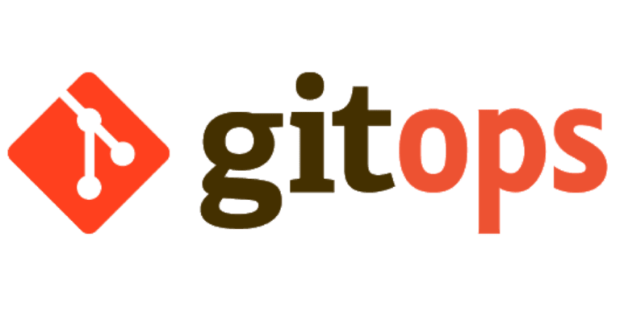
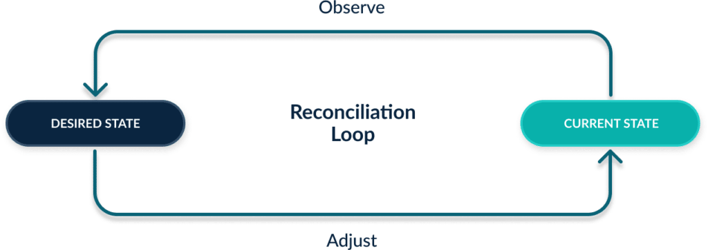

## مقدمه
یکی از اصلی‌ترین وظایف تیم دوآپس فراهم کردن و توسعه زیرساخت مناسب برای رفع نیازهای مختلف یک تیم توسعه نرم‌افزار است. در گذشته توسعه زیرساخت‌ها به صورت دستی انجام می‌شد به این صورت که فرد مسئول
(این فرد می‌توانست از اعضای تیم توسعه نرم‌افزار هم باشد)
بنا به نیازهای تیم که به او گزارش می‌شد اقدام به توسعه و فراهم کردن زیرساخت موردنیاز می‌کرد.  
این روش معایبی به همراه داشت: 
* از آنجایی که ممکن بود فرایندهای توسعه زیر ساخت توسط افراد متعددی انجام شده باشد؛ طبیعتا کدها و فایل‌های مربوط به توسعه آن زیرساخت هم در سیستم‌ها و محیط‌های مختلف قرار داشتند و در نتیجه این موضوع باعث پراکندگی فایل‌ها و کدها و ایجاد نوعی بی‌نظمی و نبود یک
Single Source of Truth
می‌شد.  
* برای بحث استقرار زیرساخت‌های توسعه یافته، نیاز بود تا به هر فرد که فرایند توسعه را به عهده داشت در محیط استقرار، دسترسی‌هایی داده می‌شد. این موضوع که افراد زیادی در یک محیط دسترسی داشته باشند
(این محیط می‌تواند یک کلاستر کوبرنتیز و یا حتی یک سرور باشد)
از لحاظ امنیتی مشکلاتی را ایجاد می‌کند.  
* هیچگونه ارزیابی روی توسعه‌های صورت گرفته بر روی زیرساخت انجام نمی‌شد و این موضوع می‌توانست باعث ایجاد خرابی در بخش‌های مختلف شود.  
* این روش با مفهوم
scalability
سازگار نیست زیرا برای استقرار هر نمونه از یک چیز، باید یک بار فرایند استقرار آن به صورت دستی انجام شود.  

برای رفع مشکلات ذکر شده و مشکلات دیگری که سیستم توسعه زیرساخت سنتی به همراه داشت، موضوعی با نام
Inferastructure as Code (IaC)
و یا در سطح بالاتر
Everything as Code (EaC یا XaC)
معرفی شد.  
در
IaC
برای توسعه زیرساخت‌ها از کد استفاده می‌شود و این کدها و فایل‌های کانفیگ با استفاده از یک سیستم ورژن کنترل مانند
Git
کنترل شده و در یک ریپو قرار داده می‌شوند تا هم از پراکندگی آن‌ها جلوگیری شود و هم از مزیت‌های وجود یک ورژن کنترل مانند سیستم
Branching
یا توانایی‌هایی نظیر
Rollback
کردن استفاده شود. این روش جدید، تعدادی از مشکلات توسعه سنتی زیرساخت را مرتفع می‌کرد اما همچنان مشکلاتی در زمینه استقرار و مسائل امنیتی دسترسی به محیط استقرار و همچنین نبود تست و بررسی خودکار برای کدهای جدید توسعه یافته به قوت خود باقی بودند. و در این مرحله بود که مفهومی به نام
GitOps
معرفی شد.  

## GitOps
مفهوم
GitOps
سعی بر کامل‌تر کردن مفهوم
IaC
دارد و از همان ایده استفاده از کد برای توسعه زیرساخت و نگهداری آن کدها در ریپازیتوری استفاده می‌کند تا از مزیت‌های آن از قبیل: 

* حل مشکل
Scalability
به دلیل استفاده از کد
* داشتن یک
Single Source of Truth
به دلیل نگهداری کدهای مربوط به توسعه در ریپازیتوری
* استفاده از مزیت‌های ورژن کنترل  

بهره ببرد. همانطور که گفته شد
IaC
مشکلاتی نیز داشت که 
GitOps
برای برطرف کردن آن‌ها از پایپلاین‌های
CI/CD
و ابزارهای مربوط به مدیریت فرایند استقرار برای توسعه زیرساخت استفاده می‌کند.  

در این روش به کدهای مربوط به توسعه زیرساخت با دیدی مشابه به کدهای مربوط به توسعه نرم‌افزار نگاه می‌شود و با استفاده از یک پایپلاین
CI
کدهای پوش شده روی یک
Feature Branch
از جهات مختلف بررسی می‌شوند و در صورت نبود مشکل و پاس کردن تست‌های طراحی شده با برنچ اصلی 
Merge
شده و سپس پایپلاین
CD
اجرا می‌شود که مسئول استقرار زیرساخت مدنظر با استفاده از کدهای توسعه داده شده است تا در صورت نیاز زیرساخت را با اعمال تغییراتی از حالت فعلی به حالت مدنظر منتقل کنند. این تغییرات می‌توانند تغییرات جزئی در 
Configuration
بخش‌های مختلف زیرساخت تا اضافه کردن و یا حذف بخش‌های بزرگی از آن را شامل شوند. در طراحی و پیاده‌سازی بخش‌های گوناگون این پایپلاین‌ها از ابزارهای مختلفی استفاده می‌شود که از معروف‌ترین آن‌ها می‌توان به
GitLab
و
Jenkins
در بخش
CI/CD
و یا
ArgoCD
که ابزاری است برای مدیریت بحث استقرار 
(به خصوص استقرار در کوبرنتیز)
اشاره کرد. هرکدام از این ابزارها با بقیه شباهت‌ها و تفاوت‌های خاص خود را دارند و برحسب این تفاوت‌هاست که کاربردهای گوناگونی نیز پیدا می‌کنند.  
به طور کلی از مفاهیم کلیدی حوزه
GitOps
می‌توان به مفاهیم زیر اشاره کرد:  

* ریپازیتوری
Git
و سیستم ورژن کنترل
* پایپلاین
CI/CD
* ابزارهای استقرار

## Push Based vs Pull Based
ابزارهای مربوط به استقرار در 
GitOps
را در حالت کلی می‌توان به دو دسته
Push Based
و 
Pull Based
تقسیم کرد. در بحث
Push Based
ابزارهایی مانند
Jenkins
و
GitLab
را داریم. نحوه کار این ابزارها به این صورت است که هر تغییر روی برنچ اصلی، فرایند استقرار را آغاز می‌کند اما در ابزارهایی مانند
ArgoCD
که در دسته
Pull Based
قرار می‌گیرند هنگام تنظیمشان مشخص می‌کنیم که در بازه‌های زمانی مشخص، برای مثال هر پنج دقیقه، برنچ اصلی را
Pull
کنند و پس از بررسی برای تغییرات احتمالی، در صورت وجود تغییر، اقدامات لازم برای گذار از محیط فعلی به محیط دلخواه را انجام دهند. 

برای آشنایی بیشتر و عمیق‌تر با مفهوم
GitOps
می‌توانید از لینک‌های زیر استفاده کنید.  

[GitOps](https://www.gitops.tech)  
[What Is GitOps? How Git Can Make DevOps Even Better](https://codefresh.io/learn/gitops/#:~:text=GitOps%20can%20be%20used%20to,move%20toward%20continuous%20operating%20models.)  
[GitOps vs DevOps](https://opstree.com/blog/2024/01/04/unraveling-the-differences-between-gitops-and-devops/#:~:text=DevOps%20provides%20a%20holistic%20approach,of%20truth%20for%20configuration%20management.)  