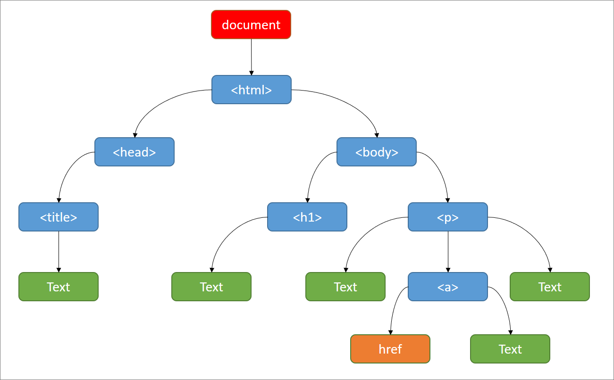
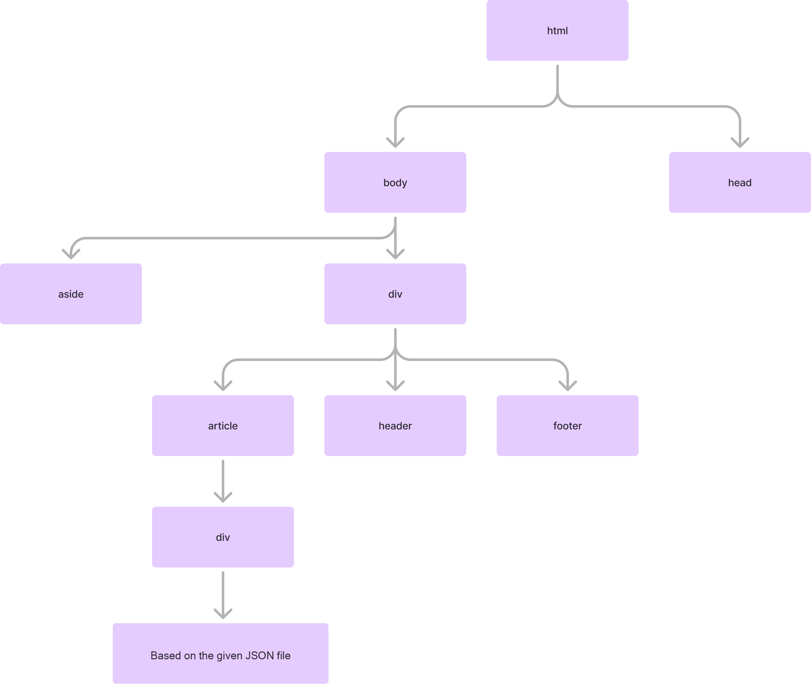

### مقدمه

سندهای
HTML
به صورت سلسله مراتبی سازماندهی شده‌اند. این ساختار به برنامه‌نویسان و مرورگرها اجازه می‌دهد تا به راحتی عناصر مختلف سند
را پیدا و دستکاری کنند. در این ساختار، هر عنصر
HTML
یک گره
(Node)
است و گره‌ها می‌توانند شامل گره‌های فرزند
(Child Nodes)
باشند. این روابط سلسله مراتبی به صورت یک درخت
(Tree)
نمایش داده می‌شود.

**انواع گره‌ها:**

- **Root Node**:
  گره ریشه در سند HTML معمولاً تگ
  `<html>`
  است که تمام عناصر دیگر سند به عنوان فرزندان آن قرار می‌گیرند.
- **Parent Nodes**:
  گره‌هایی که گره‌های فرزند دیگری را شامل می‌شوند. برای مثال، تگ
  `<body>`
  یک گره والد است که ممکن است شامل گره‌های فرزندی مانند تگ‌های
  `<div>`
  ,
  `<p>`
  ,
  `<a>`
  و غیره باشد.
- **Child Nodes**: گره‌هایی که درون گره‌های والد قرار می‌گیرند. برای مثال، تگ
  `<li>`
  یک گره فرزند برای گره والد
  `<ul>`
  یا
  `<ol>`
  است.
- **Sibling Nodes**: گره‌هایی که یک والد مشترک دارند. برای مثال، دو گره
  `<p>`
  که هر دو داخل یک
  `<div>`
  قرار دارند، گره‌های خواهر هستند.
- **Leaf Nodes**: گره‌هایی که هیچ فرزندی ندارند، معمولاً گره‌های متنی یا گره‌های بدون محتوای داخلی مانند
  ``.

### آشنایی با DOM

**DOM**
یا
**Document Object Model**
یک **رابط ** است که اجازه دسترسی و تغییر ساختار سند‌های HTML را به کاربر می‌دهد. این رابط توسط مرورگرها و به واسطه یک
زبان برنامه‌نویسی مانند جاوااسکریپت در دسترس کاربر قرار می‌گیرد.

#### ساختار DOM

DOM
شامل گره‌های مختلفی است که هر یک نوع خاصی از داده‌ها یا بخش‌های سند را نشان می‌دهند. انواع اصلی گره‌ها عبارتند از:

- **Document Node**: ریشه درخت
  DOM
  که نمایانگر کل سند است.
- **Element Nodes**: نمایانگر تگ‌های
  HTML
  مانند `<div>`, `<p>`, `<a>` و غیره.
- **Text Nodes**: نمایانگر متن‌های داخل تگ‌ها.
- **Attribute Nodes**: نمایانگر صفات تگ‌ها مانند
  `class`, `id`.
- **Comment Nodes**: نمایانگر نظرات موجود در سند

#### کاربردهای DOM

- **دستکاری محتوا:** DOM
  به شما امکان می‌دهد محتوای
  HTML
  را به صورت پویا تغییر دهید، مانند اضافه کردن، حذف یا ویرایش عناصر و متن.
- **مدیریت استایل:** DOM به شما امکان می‌دهد استایل عناصر
  HTML
  را به صورت پویا تغییر دهید، مانند تغییر رنگ، اندازه و موقعیت.
- **ایجاد رفتارهای تعاملی:**
  DOM
  به شما امکان می‌دهد رفتارهای تعاملی به صفحات وب اضافه کنید، مانند کلیک کردن، کشیدن و رها کردن و تغییر ورودی کاربر.

#### Selectors در DOM

سلکتورها ابزارهای قدرتمندی برای انتخاب و دستکاری عناصر در ساختار
DOM
هستند. آنها به برنامه‌نویسان اجازه می‌دهند تا به طور دقیق و کارآمد عناصر مورد نظر خود را در صفحات وب شناسایی و انتخاب
کنند. سلکتورها می‌توانند بر اساس نام عنصر، شناسه، کلاس، ویژگی‌ها و روابط بین عناصر عمل کنند.

فرض کنید ما یک صفحه
HTML
با ساختار زیر داریم:

```html

<div id="container">
    <h1 class="title">Welcome to My Website</h1>
    <p class="content">This is some content.</p>
    <ul>
        <li>Item 1</li>
        <li class="special">Item 2</li>
        <li>Item 3</li>
    </ul>
    <button id="submitBtn">Submit</button>
</div>
```

حالا، بیایید چند نمونه از سلکتورها را با استفاده از
JavaScript
ببینیم:

1. انتخاب با ID:

```javascript
let submitButton = document.getElementById('submitBtn');
// یا
let submitButton = document.querySelector('#submitBtn');
```

2. انتخاب با کلاس:

```javascript
let contentParagraph = document.querySelector('.content');
```

3. انتخاب همه عناصر با یک کلاس خاص:

```javascript
let allSpecialItems = document.querySelectorAll('.special');
```

4. انتخاب بر اساس Tag Name:

```javascript
let allListItems = document.querySelectorAll('li');
```

5. انتخاب با ترکیب سلکتورها:

```javascript
let specialItemInContainer = document.querySelector('#container .special');
```

6. انتخاب بر اساس Attributes:

```javascript
let submitButton = document.querySelector('button[id="submitBtn"]');
```

#### Attributes در DOM

Element attributes
در DOM، اطلاعات اضافی هستند که به عناصر
HTML
اضافه می‌شوند تا خصوصیات و رفتار آنها را تعریف کنند. این ویژگی‌ها می‌توانند شامل مواردی مانند
id، class، style، src
و غیره باشند. در
DOM
، هر عنصر دارای یک مجموعه از ویژگی‌هاست که می‌توان به آنها دسترسی پیدا کرد، آنها را تغییر داد یا ویژگی‌های جدیدی اضافه
کرد.

فرض کنید ما یک عنصر
HTML
به شکل زیر داریم:

```html

```

حالا، بیایید با استفاده از
JavaScript،
چند عملیات مختلف روی ویژگی‌های این عنصر انجام دهیم:

```javascript
// Get a reference to the image element with ID "myImage"
let img = document.getElementById('myImage');

// Get the current image source and log it
let imgSrc = img.getAttribute('src');
console.log('Current image source:', imgSrc);

// Update the image source to "new-image.jpg"
img.setAttribute('src', 'new-image.jpg');

// Set a new title attribute for the image
img.setAttribute('title', 'This is a new title');

// Check if the image has an "alt" attribute
if (img.hasAttribute('alt')) {
    console.log('This image has an alt text');
}

// Remove any existing "class" attribute
img.removeAttribute('class');

// Get and log the updated image source and alt text (if it exists)
console.log('Updated image source:', img.src);
console.log('Current alt text:', img.alt);  // Might be empty if no alt attribute

// Set multiple class names using className property
img.className = 'new-class another-class';

// Set custom data attribute using dataset property
img.dataset.customInfo = 'Some custom data';
console.log('Custom data:', img.dataset.customInfo);

// Loop through all image attributes and log them
for (let attr of img.attributes) {
    console.log(`${attr.name}: ${attr.value}`);
}
```

این مثال نشان می‌دهد که چگونه می‌توان به روش‌های مختلف با
Attributes
عناصر در
DOM
کار کرد.

:::tip ‌

برای آشنایی با
dataset
لینک زیر را مطالعه کنید:

[Using data attributes](https://developer.mozilla.org/en-US/docs/Learn/HTML/Howto/Use_data_attributes)
:::

### Manipulation در DOM

DOM Manipulation
یا دستکاری
DOM
، یکی از مهم‌ترین جنبه‌های برنامه‌نویسی وب پویا است که به توسعه‌دهندگان اجازه می‌دهد ساختار، محتوا و سبک صفحات وب را به
صورت پویا و در زمان اجرا تغییر دهند. این فرآیند شامل انتخاب عناصر
HTML
، تغییر محتوا و ویژگی‌های آنها، اضافه یا حذف عناصر، و تغییر استایل‌های CSS می‌شود. با استفاده از
JavaScript،
برنامه‌نویسان می‌توانند به راحتی به عناصر
DOM
دسترسی پیدا کرده و آنها را دستکاری کنند، که این امر امکان ایجاد رابط‌های کاربری تعاملی و پاسخگو را فراهم می‌کند.

#### Element Manipulation در DOM

فرض کنید یک عنصر
div
با شناسه
"container"
در
HTML
داریم

```javascript
// Get the container element with the ID "container"
let container = document.getElementById('container');

// Create a new paragraph element and set its text content
let newParagraph = document.createElement('p');
newParagraph.textContent = 'This is a new paragraph.';

// Append the paragraph element to the container
container.appendChild(newParagraph);

// Create a new button element and set its text content
let newButton = document.createElement('button');
newButton.textContent = 'Click Me';

// Append the button element to the container
container.appendChild(newButton);

// Remove the paragraph element from the container
container.removeChild(newParagraph);

// Create a new div element and set its text content
let replacementDiv = document.createElement('div');
replacementDiv.textContent = 'This replaces the button';

// Replace the button element with the div element
container.replaceChild(replacementDiv, newButton);

// Clone the div element
let clonedDiv = replacementDiv.cloneNode(true);

// Append the cloned div element to the container
container.appendChild(clonedDiv);

// Set the inner HTML of the cloned div element to bold text
clonedDiv.innerHTML = '<strong>This content has changed</strong>';

// Create another paragraph element and set its text content
let anotherParagraph = document.createElement('p');
anotherParagraph.textContent = 'This paragraph was added before the div';

// Insert the another paragraph element before the replacement div element
container.insertBefore(anotherParagraph, replacementDiv);

// Set the class attribute of the another paragraph element to "highlight"
anotherParagraph.setAttribute('class', 'highlight');

// Add a click event listener to the replacement div element
replacementDiv.addEventListener('click', function () {
    alert('The div was clicked!');
});
```

این مثال‌ها نشان می‌دهند که چگونه می‌توان با استفاده از
JavaScript
، عناصر
DOM
را به روش‌های مختلف دستکاری کرد و تغییر داد.

#### Style Manipulation در DOM

فرض کنید ما یک عنصر
HTML
به شکل زیر داریم:

```html

<div id="myDiv" class="box">Hello, World!</div>
```

حالا، بیایید با استفاده از
JavaScript،
استایل این عنصر را تغییر دهیم:

###### تغییر استایل با استفاده از خاصیت `style`

```javascript
let myDiv = document.getElementById('myDiv');

myDiv.style.backgroundColor = 'lightblue';

myDiv.style.color = 'white';

myDiv.style.fontSize = '20px';

myDiv.style.margin = '10px';
```

##### استفاده از `classList` برای مدیریت کلاس‌ها

```javascript
myDiv.classList.add('highlight');

myDiv.classList.remove('box');

if (myDiv.classList.contains('highlight')) {
    console.log('The highlight class is applied');
}

myDiv.classList.toggle('active');
```

##### استفاده از `cssText` برای تنظیم چندین استایل به صورت یکجا

```javascript
myDiv.style.cssText = `
    background-color: lightgreen;
    color: black;
    font-size: 18px;
    padding: 15px;
    border: 2px solid black;
`;
```

##### اضافه کردن استایل‌های پویا با استفاده از `setAttribute`

```javascript
myDiv.setAttribute('style', 'background-color: pink; color: blue; font-weight: bold;');
```

ما می‌توانیم این کلاس‌ها را به عناصر
HTML
اضافه کنیم یا حذف کنیم تا استایل‌های آنها را تغییر دهیم.

- [Introduction to the DOM](https://developer.mozilla.org/en-US/docs/Web/API/Document_Object_Model/Introduction)
- [HTML attributes](https://javascript.info/dom-attributes-and-properties#html-attributes)
- [Manipulating documents](https://developer.mozilla.org/en-US/docs/Learn/JavaScript/Client-side_web_APIs/Manipulating_documents)

### پروژه



#### هدف

در این پروژه، ;کارآموزان باید با استفاده از
HTML
، یک ساختار
DOM
را که در یک تصویر نشان داده شده است، پیاده‌سازی کنند.

#### مراحل

1. با توجه به تصویر نشان‌ داده شده سند
   HTML
   مورد نظر را ایجاد کنید.
2. در یک گزارش توضیح دهید چرا استفاده از این ساختار سلسله مراتبی بهتر از استفاده از یک تگ خاص مانند
   Div
   برای همه المان ها است.
3. با استفاده از [فایل JSON](../../static/datasets/books.json) ای که در اختیارتون قرار داده شده است آیتم های قسمت
   Article
   را بسازید.

#### نکات

- ساختار سلسله‌مراتبی و گزارش خود را برای منتور خود ارسال کنید.
