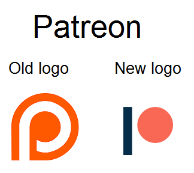

:::info این فاز، یکی از فازهای
`Readonly`
است.

به فازهایی
`Readonly`
می‌گوییم که کارگاهی برای آن‌ها برگزار نمی‌شود و صرفاً برای اموزش به مستندات اکتفا می‌کنیم.

:::

## مقدمه

فرض کنید یک اپلیکیشن خرید آنلاین داریم که هدف آن فروش محصولات مختلف به کاربران است. یکی از ویژگی‌های کلیدی این اپلیکیشن، نمایش محصولات مشابه است. اگر اپلیکیشن دارای یک طراحی خوب باشد، می‌تواند محصولات مشابه را به صورت واضح و جذاب نمایش دهد.

برای مثال، اگر اپلیکیشن دارای یک بخش "محصولات مشابه" باشد که به صورت واضح و با تصاویر جذاب نمایش داده شود، کاربر می‌تواند به راحتی محصولات مشابه را مشاهده کند و تصمیم خرید را با اطمینان بیشتری بگیرد. همچنین، اگر اپلیکیشن دارای یک فیلتر و مرتب‌سازی مناسب باشد، کاربر می‌تواند به راحتی محصولات را بر اساس قیمت، برند و سایر ویژگی‌ها فیلتر کند و به محصول مورد نظر خود دسترسی پیدا کند.

از سوی دیگر، اگر اپلیکیشن دارای یک طراحی ضعیف باشد، بخش "محصولات مشابه" ممکن است به صورت نامنظم و بدون تصاویر جذاب نمایش داده شود. این می‌تواند باعث شود کاربر نتواند به راحتی محصولات مشابه را مشاهده کند و تصمیم خرید را با اطمینان بیشتری بگیرد. بنابراین، یک طراحی خوب می‌تواند به افزایش رضایت کاربر، بهبود نرخ تبدیل و افزایش وفاداری مشتری کمک کند.

-   تفاوت UI و UX چیست؟
-   کدام رنگ‌ها هم‌نشینی بهتری با یکدیگر دارند؟
-   چه فونت‌هایی برای استفاده در سایت پیشنهاد می‌شوند؟

توصیه می‌کنیم همزمان با خواندن این مطلب،
[صفحۀ دمو](https://star-academy.github.io/frontend-demos/pages/ui-ux/)
را نیز مشاهده کنید تا به صورت دیداری و کاربردی با مفاهیم آشنا شوید.

---

## یادگیری

### تفاوت UI با UX

قطعاً بارها این دو کلمه را در جاهای مختلف شنیده‌اید.
UI
یا
User Interface
به معنای رابط کاربری، مربوط به المان‌هایی است که کاربر با آن‌ها ارتباط دارد.
UX
یا
User Experience
به معنای تجربۀ کاربری، مربوط به کیفیتی است که کاربر هنگام استفاده از محصول تجربه می‌کند.

برای آشنایی بیشتر با این مفهوم می‌توانید از لینک‌های زیر استفاده کنید:

-   [The difference between UI and UX, according to designer and Maze CEO, Jonathan Widawski](https://maze.co/blog/ui-vs-ux/)
-   [UI vs. UX: What’s the difference between user interface and user experience?](https://www.usertesting.com/blog/ui-vs-ux)
-   [The Difference Between UX and UI Design – A Beginner’s Guide](https://careerfoundry.com/en/blog/ux-design/the-difference-between-ux-and-ui-design-a-laymans-guide/)

### اصول پایه

در این قسمت به توضیح اصول هفتگانۀ طراحی می‌پردازیم که شناخت و رعایت آن‌ها حیاتی است.

#### White Space

المان‌های شما باید فضای کافی برای تنفس داشته باشند.
هرگز حجم انبوهی از اطلاعات را در یک مکان کوچک جا ندهید
چرا که کاربر نمی‌تواند به اندازۀ کافی تمرکز کند و این مسئله برایش عذاب‌آور خواهد بود.

برای ایجاد
White Space
، راحت‌ترین کار استفاده از
`margin`
و
`padding`
است.
همچنین در
flexbox و grid
می‌توانید از
`gap`
استفاده کنید.

#### Color

رنگ‌ها و روانشناسی آن‌ها موضوعی است که سال‌ها طراحان را درگیر خود کرده.
هر رنگ نشان‌دهندۀ مجموعه‌ای از مفاهیم است که به آن روانشناسی رنگ‌ها گفته می‌شود.
به عنون مثال رنگ آبی نشانۀ صلح، آرامش، اعتماد، امنیت و ... می‌باشد؛
به همین خاطر خیلی از شرکت‌های بزرگ دنیا مانند Facebook و Twitter از این رنگ در محصولات خود استفاده می‌کنند.

همچنین زمانی که بخواهید بیش از یک رنگ داشته باشید،
باید دقت کنید که رنگ‌های انتخابی شما یکدگیر را تکمیل کنند.
اگر از دو رنگ استفاده می‌کنید، معمولاً توصیه می‌شود رنگ‌های متضاد را انتخاب کنید.
به‌عنوان مثال اگر رنگ اول شما آبی است، رنگ دوم را می‌توانید نارنجی بگذارید.

در پوستر خیلی از فیلم‌ها این موضوع را می‌توان مشاهده کرد:

برای انتخاب رنگ‌بندی، ما سایت
[Adobe Color](https://color.adobe.com/create/color-wheel)
را پیشنهاد می‌کنیم.
ابتدا از سمت چپ، نوع قالب رنگی را مشخص کنید،
سپس با استفاده از
Color Wheel
در وسط صفحه، رنگ اصلی را انتخاب کنید.
مشاهده خواهید کرد که ادوبی، باقی رنگ‌ها را به طور خودکار در اختیار شما قرار می‌دهد.

همچنین از ابزارهای زیر برای ساخت قالب رنگی می‌توانید استفاده کنید:

-   [Coolors](https://coolors.co/)
-   [Canva - Colors](https://www.canva.com/colors/)
-   [Flat UI Colors 2](https://flatuicolors.com/)
-   [Colorsinspo](https://colorsinspo.com/)
-   [uiGradients](https://uigradients.com/)
-   [Flatuicolorpicker](https://www.flatuicolorpicker.com/)

برای آشنایی بیشتر با این مفهوم می‌توانید از لینک‌های زیر استفاده کنید:

-   [The Know It All Guide To Color Psychology In Marketing + The Best Hex Chart](https://coschedule.com/blog/color-psychology-marketing)
-   [Color Psychology in Marketing and Branding is All About Context](https://www.helpscout.com/blog/psychology-of-color/)

#### Contrast

تضاد موضوعی است که به‌شدت با رنگ‌ها در ارتباط است.
Contrast
یعنی تضاد بین رنگ‌ها.
به‌عنوان مثال اگر دکمه‌ای داشته باشیم،
می‌توان تضاد بین رنگ نوشته و رنگ پس‌زمینه را در نظر گرفت.

استانداردی به نام
WCAG
وجود دارد که بیان می‌کند چه نسبتی بین نوشته و پس‌زمینه باید وجود داشته باشد.
این استاندارد شامل دو حالت
AA و AAA
است که حالت دوم رتبه‌بندی بهتری دارد و در صورت امکان باید آن را در نظر گرفت.

همچینن میزان
Contrast
به اندازۀ متن نیز وابسته است.
به‌عنوان مثال در رتبه‌بندی
AA
اگر اندازۀ متن معمولی باشد، نسبت
Contrast
باید حداقل 4.5 به 1 باشد؛
اما اگر اندازۀ متن بزرگ باشد، این نسبت می‌تواند تا 3 به 1 کاهش پیدا کند.

برای بدست آوردن این نسبت می‌توانید از ابزارهای زیر استفاده کنید:

-   [Colour Contrast Checker](https://colourcontrast.cc/)
-   [Adobe Contrast Checker](https://color.adobe.com/create/color-contrast-analyzer)

برای آشنایی بیشتر با این مفهوم می‌توانید از لینک‌های زیر استفاده کنید:

-   [MDN - Color contrast](https://developer.mozilla.org/en-US/docs/Web/Accessibility/Understanding_WCAG/Perceivable/Color_contrast)
-   [The Myths of Color Contrast Accessibility](https://uxmovement.com/buttons/the-myths-of-color-contrast-accessibility/)
-   [How to use contrast in UI Design](https://blog.prototypr.io/how-contrast-works-in-ui-design-21bf75a5a2bf)

#### Visual Hierarchy

زمانی که کاربر وارد صفحه می‌شود، با چشمانش المان‌های صفحه را به ترتیب بررسی می‌کند
که به آن
Visual Hierarchy
گفته می‌شود.
همواره المان‌های مهم‌تر باید رتبۀ بالاتری در این رده‌بندی داشته باشند.
به‌عنوان مثال تیتر یک صفحه از اهمیت بالایی برخوردار است اما تاریخ نگارش آن ممکن است خیلی مهم نباشد.

برای بالا بردن رتبۀ یک المان و جلب توجه کاربر از موارد متعددی مانند سایز و وزن فونت، فضای تنفس، رنگ و انیمیشن می‌توانید استفاده کنید.

برای آشنایی بیشتر با این مفهوم می‌توانید از لینک‌های زیر استفاده کنید:

-   [6 principles of visual hierarchy for designers](https://en.99designs.nl/blog/tips/6-principles-of-visual-hierarchy/)
-   [Key Principles of Visual Hierarchy in UX Design](https://xd.adobe.com/ideas/process/information-architecture/visual-hierarchy-principles-examples/)

#### Alignment

Alignment
یا تراز بودن، به شدت ارتباط تنگاتنگی با
Visual Hierarchy
دارد
و اگر بتوان از این دو به درستی استفاده کرد،
شاهد یک
UI و UX
حرفه‌ای خواهیم بود.

المان‌هایی که
Contrast
بالایی دارند، باید در یک ستون نسبت به المان‌های بالا و پایین خود قرار داشته باشند.
به این ترتیب می‌توان یک ساختار مشخص ایجاد و به بهبود تمرکز کاربر کمک کرد.

در اکثر مواقع توصیه نمی‌کنیم المان‌ها را به صورت وسط‌چین تنظیم کنید؛
مگر اینکه فضای کوچکی مانند صفحه نمایش تلفن همراه در اختیار داشته باشید.
همچنین در موارد محدود می‌توانید
Hero Section
خود را به این شکل انتخاب کنید.
اما بیشتر اوقات بهتر است با توجه به
RTL
یا
LTR
بودن سایت، همان جهت را برای تراز کردن المان‌ها انتخاب کنید.

برای آشنایی بیشتر با این مفهوم می‌توانید از لینک‌های زیر استفاده کنید:

-   [Principles of Design: Alignment](https://uxengineer.com/principles-of-design/alignment/)
-   [Alignment Principle in Design: Importance & Examples](https://ux360.design/alignment-principle-design/)

#### Typography

تایپوگرافی چیزی فراتر از انتخاب یک فونت مناسب است.
تمام سایت‌ها از متن استفاده می‌کنند.
این متن می‌تواند در جایی مثل تیتر، پاراگراف یا دکمه استفاده شود.
بنابراین تنظیم‌کردن خصوصیات این متون باید به بهترین شکل ممکن انجام شود.

همچنین برای پاراگراف‌ها و متن‌های طولانی توصیه می‌شود با توجه به نوع مطلب،
عرض خطوط بین 40 تا 70 کاراکتر باشد.
این مسئله به‌شدت به خوانایی متن کمک می‌کند.

برای آشنایی بیشتر با این مفهوم می‌توانید از لینک‌های زیر استفاده کنید:

-   [10 Principles for Typography in UI Design](https://uxdesign.cc/10-principles-for-typography-usage-in-ui-design-a8f038f43ffd)
-   [8 Rules for Perfect Typography in UI](https://blog.prototypr.io/8-rules-for-perfect-typography-in-ui-21b37f6f23ce)
-   [Typography in UI Design](https://xd.adobe.com/ideas/process/ui-design/typography-in-ui-design/)

#### Simplicity

تا جایی که می‌توانید سعی کنید ذهن کاربر را با افکت‌های عجیب و غریب مشغول نکنید.
سعی کنید همه چیز کاملاً ساده، گویا و بدونِ حشو باشد.
به‌کارگیری افکتی که به تازگی آن را یاد گرفته‌اید ممکن است برای شخص شما بسیار جذّاب باشد،
اما برای اکثر کاربران صرفاً باری اضافه و امتیازی منفی محسوب می‌شود.

از سایه‌ها فقط و فقط در جایی که به آن احتیاج دارید استفاده کنید.
پیشنهاد می‌کنیم از
`border` و `outline`
استفاده نکنید،
اما اگر اصرار بر این کار دارید، نوع، اندازه و رنگ آن‌ها باید طوری انتخاب شود که توجه زیادی را از کاربر نگیرد.
Gradiant
فقط زمانی خوب به نظر می‌آیند که بی‌نقص پیاده‌سازی شده باشند؛
بنابراین در حالت کلی بهتر است از رنگ‌های
Solid
استفاده کنید.

از طرفی باید دقت کنید که طرح شما
Over-simplified
نباشد.
این اتفاق بر سر بسیاری از لوگوها آمده و کاربران از آن بیزارند.
همه چیز باید به اندازه باشد تا بهترین
UI و UX
حاصل شود.

برای آشنایی بیشتر با این مفهوم می‌توانید از لینک‌های زیر استفاده کنید:

-   [Why Simplicity is so Incredibly Important in UX Design](https://careerfoundry.com/en/blog/ux-design/how-important-is-simplicity-in-ux-design/)
-   [False Simplicity in UI Design: Simple is not always better](https://tomkenny.design/articles/false-simplicity)

---

## پروژه

سایتی که تا اینجا طراحی کرده‌اید را از منظر
UI و UX
بررسی کنید. در صورتی که جایی از سایت مشکلی مشاهده می‌کنید، آن را برطرف کنید.
