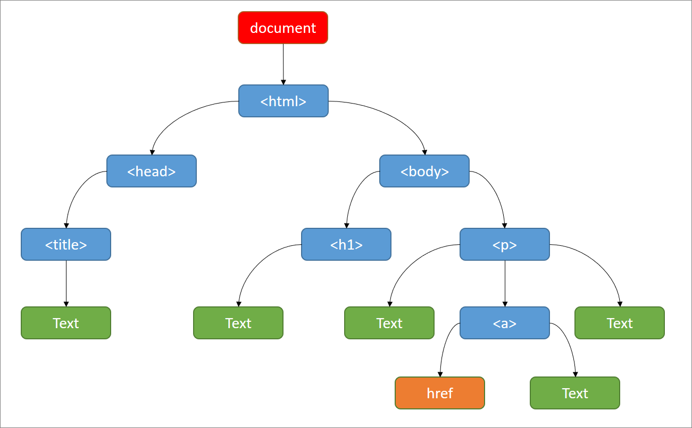

### ساختار سلسله مراتبی سندهای HTML

سندهای
HTML
به صورت سلسله مراتبی سازماندهی شده‌اند. این ساختار به برنامه‌نویسان و مرورگرها اجازه می‌دهد تا به راحتی عناصر مختلف سند را پیدا و دستکاری کنند. در این ساختار، هر عنصر
HTML
یک گره
**(Node)**
است و گره‌ها می‌توانند شامل گره‌های فرزند
**(Child Nodes)**
باشند. این روابط سلسله مراتبی به صورت یک درخت
**(Tree)**
نمایش داده می‌شود.

**انواع گره‌ها:**

-   **Root Node**:
    گره ریشه در سند HTML معمولاً تگ
    `<html>`
    است که تمام عناصر دیگر سند به عنوان فرزندان آن قرار می‌گیرند.
-   **Parent Nodes**:
    گره‌هایی که گره‌های فرزند دیگری را شامل می‌شوند. برای مثال، تگ
    `<body>`
    یک گره والد است که ممکن است شامل گره‌های فرزندی مانند تگ‌های
    `
`
    ,
    `
`
    ,
    `<a>`
    و غیره باشد.
-   **Child Nodes**: گره‌هایی که درون گره‌های والد قرار می‌گیرند. برای مثال، تگ
    `<li>`
    یک گره فرزند برای گره والد
    `<ul>`
    یا
    `<ol>`
    است.
-   **Sibling Nodes**: گره‌هایی که یک والد مشترک دارند. برای مثال، دو گره
    `
`
    که هر دو داخل یک
    `
`
    قرار دارند، گره‌های خواهر هستند.
-   **Leaf Nodes**: گره‌هایی که هیچ فرزندی ندارند، معمولاً گره‌های متنی یا گره‌های بدون محتوای داخلی مانند
    ``.

### آشنایی با DOM

**DOM**
یا
**Document Object Model**
یک **رابط ** است که اجازه دسترسی و تغییر ساختار سند‌های HTML را به کاربر می‌دهد. این رابط توسط مرورگرها و به واسطه یک زبان برنامه‌نویسی مانند جاوااسکریپت در دسترس کاربر قرار می‌گیرد.

**ساختار DOM:**

DOM
شامل گره‌های مختلفی است که هر یک نوع خاصی از داده‌ها یا بخش‌های سند را نشان می‌دهند. انواع اصلی گره‌ها عبارتند از:

-   **Document Node**: ریشه درخت
    DOM
    که نمایانگر کل سند است.
-   **Element Nodes**: نمایانگر تگ‌های
    HTML
    مانند `
`, `
`, `<a>` و غیره.
-   **Text Nodes**: نمایانگر متن‌های داخل تگ‌ها.
-   **Attribute Nodes**: نمایانگر صفات تگ‌ها (مانند
    `class`, `id`).
-   **Comment Nodes**: نمایانگر نظرات موجود در سند

**کاربردهای DOM:**

-   **دستکاری محتوا:** DOM
    به شما امکان می‌دهد محتوای
    HTML
    را به صورت پویا تغییر دهید، مانند اضافه کردن، حذف یا ویرایش عناصر و متن.
-   **مدیریت استایل:** DOM به شما امکان می‌دهد استایل عناصر
    HTML
    را به صورت پویا تغییر دهید، مانند تغییر رنگ، اندازه و موقعیت.
-   **ایجاد رفتارهای تعاملی:**
    DOM
    به شما امکان می‌دهد رفتارهای تعاملی به صفحات وب اضافه کنید، مانند کلیک کردن، کشیدن و رها کردن و تغییر ورودی کاربر.

برای آشنایی بیشتر با این مفهوم می‌توانید از لینک‌ زیر استفاده کنید:

-   <https://developer.mozilla.org/en-US/docs/Web/API/Document_Object_Model>
