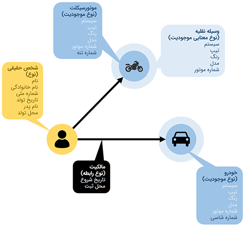
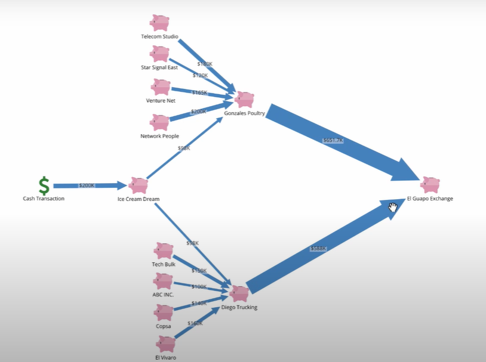
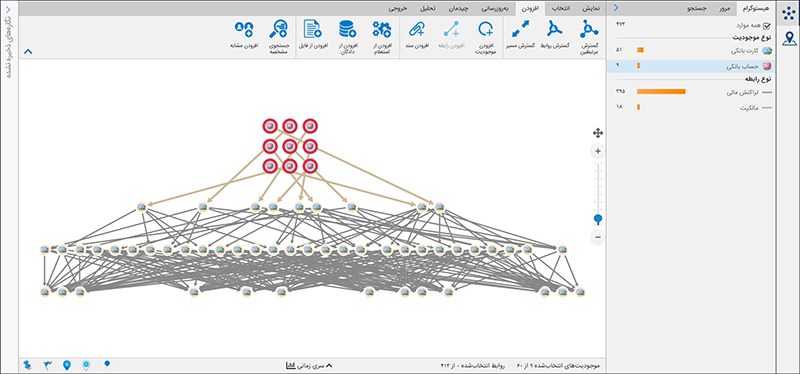

فرض کنید پرونده‌ی یک تخلف بانکی، بیمه‌ای، مالیاتی، پول‌شویی، قمار یا ... به دست شما رسیده است و می‌خواهید درباره آن تحقیق کنید.
بدون استفاده از یک ابزار بصری‌سازی، ناچارید زمان بسیار زیادی را برای جستجو در پایگاه‌های
داده‌ی متعدد و پراکنده صرف کنید تا اطلاعات مورد نیاز خود را به دست آورید، و بعد از به دست آمدن اطلاعات نیز، زمان بیشتری
را به کشف و برقراری ارتباط بین داده‌های پراکنده اختصاص دهید.
به عنوان مثال در پرونده‌ی پول‌شویی، ناگزیرید اطلاعات مربوط به حساب‌ها را از پایگاه‌های داده‌ی بانک‌ها، اطلاعات مربوط به
تراکنش‌های بانکی را از بانک مرکزی و بانک‌های عامل، اطلاعات مربوط به اشخاص و ارتباط آنها را از سازمان ثبت احوال، اطلاعات
مربوط به دارایی‌ها را از سازمان ثبت اسناد و املاک و ... استخراج کنید و ارتباط بین این داده‌ها را نیز به صورت دستی برقرار
سازید.
به این ترتیب، ناچارید بخش اعظم زمان و انرژی خود را به جای تمرکز بر پیچیدگی‌های پرونده، برای گردآوری اطلاعات صرف کنید یا
منتظر دریافت اطلاعات بمانید. اما در مقابل، می‌توانید با استفاده از یک ابزار مناسب
داده‌های خود را به حالتی که به راحتی قابل مشاهده و تحلیل باشد درآورده و 
بر روی حل پرونده‌ها تمرکز کنید.
  
همانطور که گفتیم، یکی از بهترین راه‌های تحلیل داده، مصورسازی آن است. یکی از راه‌های مصورسازی که می‌تواند به
شناخت بهتر ارتباطات کمک کند، استفاده از گراف برای نمایش موجودیت‌ها و ارتباطات بین آن‌ها است. 
هر فرد جهان اطراف خود را در قالب یک مدل تحلیل می‌کند؛ به این معنا که آن‌چه را که می‌بیند، 
می‌شنود، و به طور کلی تجربه می‌کند در قالب‌هایی تعریف‌شده قرار می‌دهد و رابطه‌هایی بین آنها 
برقرار می‌کند. برای نمونه او در اطراف خود انسان، خودرو، و ساختمان می‌بیند و بین آنها 
رابطه‌هایی مثل فرزندی، راندن، و پارک شدن قائل می‌شود. انسانی فرزند انسانی دیگر است، انسانی 
رانندهی یک خودروست، و خودرویی در ساختمانی پارک می‌شود. به علاوه، هر انسان، خودرو، و ساختمان مشخصاتی دارد. برای مثال، انسان دارای نام و نام خانوادگی و تاریخ تولد است. خودرو رنگ دارد. 
ساختمان هم در نشانی مشخصی واقع شده است.
در این پروژه‌ می‌خواهیم ابزاری برای بصری‌سازی و تحلیل‌داده‌ها بر روی گراف ایجاد کنیم و از آن 
برای حل مسائل مختلفی که شاخصه اصلی آن‌ها روابط بین موجودیت‌های آن‌ها است، استفاده کنیم.

## پلتفرم تحلیل روابط

جالب است بدانید که منبع الهام این پروژه، یکی از محصولات ستاره به نام پلتفرم تحلیل روابط است، این پلتفرم داده‌های پیچیده را در خود ذخیره کرده و با دریافت تعاریف موجودیت‌های مختلف
و روابط بین آن‌ها به کاربر اجازه می‌دهد که در این موجودیت‌ها جست‌وجو کرده و با ایجاد گراف ارتباطات بین آن‌ها، با سرعت بیشتری به تحلیل آن‌ها بپردازد.
