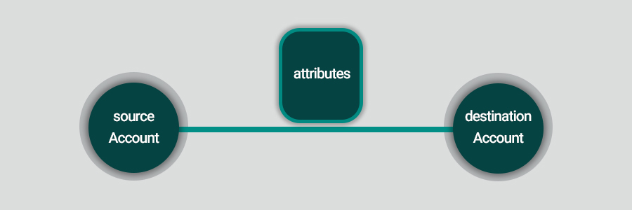

در این فاز باید یک فایل حاوی دیتای تراکنش‌ها را از مدیر داده دریافت و ذخیره کنیم و سپس تراکنش‌ها را در قالب یک گراف به کاربر نمایش دهیم.

## ساختار داده و تعریف اجزای آن به عنوان بخش‌های گراف

در پروژه ما هرچیزی به شکل یکی از سه مورد زیر تعریف خواهد شد:

1. راس گراف
2. یال گراف
3. مشخصه‌ای درباره یکی از دو مورد بالا

ما در این پروژه با داده‌های فرضی تراکنش‌های بانکی سر و کار داریم. مجموعه داده باید به صورت یک فایل
csv
به برنامه داده شده و داده‌های ورودی به صورت یک جدول به کاربر نمایش داده شود. (در این فاز می‌توانید فرض کنید که جداول تنها تراکنش و حساب بانکی هستند اما بهتر است که ورودی جدول را به صورت پویا پیاده کنید تا بعدا توانایی اضافه کردن قابلیت‌های دیگر به آن را داشته باشید.)

[Transactions](/datasets/transactions.zip)

این داده‌ها شامل تعداد زیادی رکورد است. هر رکورد شامل اطلاعات زیر است:

1. شماره حساب مبدا
2. شماره حساب مقصد
3. مبلغ تراکنش
4. تاریخ تراکنش
5. شماره مرجع تراکنش

در شکل زیر یک نمونه از دیتابیس حاوی اطلاعات تراکنش را مشاهده می‌کنید:

در این فاز قرارداد می‌کنیم که حساب مبدا و مقصد به صورت راس‌های گراف و تراکنش‌ بین‌ آن‌ها به صورت یال گراف نمایش داده شود. همچنین مقدار تراکنش‌ها و تاریخ تراکنش به عنوان مشخصه یال تراکنش باشند.

چیزی که در اینجا درباره آن صبحت کردیم، یعنی طرز نگرش به پدیده‌های پروژه و تعریف آن‌ها به صورت خاص، با اصطلاح آنتولوژی شناخته می‌شود. که در فازهای بعدی، بیشتر با آن آشنا خواهیم شد.

## مصورسازی

حال باید بتوانیم هر سطر موجود در پایگاه داده را که معادل یک تراکنش بانکی است، به صورت یک دمبل نشان دهیم. با پیاده‌سازی این ویژگی، امکان فراهم‌کردن بسیاری از قابلیت‌های پرکاربرد و ارزشمند فراهم می‌شود.

در واقع ما سعی داریم چیزی شبیه به عکس زیر را پیاده‌سازی کنیم.

لازم به ذکر است که کادر موجود در بالای یال، نشان‌ دهنده‌ی لیست مشخصه‌هایی است که باید برای یال آورده شود.

پیشنهاد می‌شود شماره حساب روی راس گراف نمایش داده شود تا در فاز بعدی کار راحت‌تر باشد.

دست شما در پیاده‌سازی
UI
باز است و با رعایت چارچوپ اولیه، می‌توانید از شکل و رنگ‌های مختلف در طراحی المان‌ها استفاده‌کنید.
ما با پیاده‌سازی این فاز، بعد از این که توانستیم هر رکورد را به صورت یک دمبل نشان بدهیم، آماده می‌شویم تا در آینده برنامه را به ابزارهای تحلیل مجهز کنیم.

## نمایش اطلاعات حساب

بعد از این که دمبل یک تراکنش روی بوم گراف ظاهر شد، کاربری که از برنامه استفاده می‌کند باید این امکان را داشته باشد که با کلیک روی راس گراف، اطلاعات حساب را ببیند. برای این کار پیشنهاد می‌شود که بعد از کلیک، اطلاعات حساب از مجموعه داده دوم برداشته شود و در یک منو از سمت راست، کنار صفحه نمایان شود.
