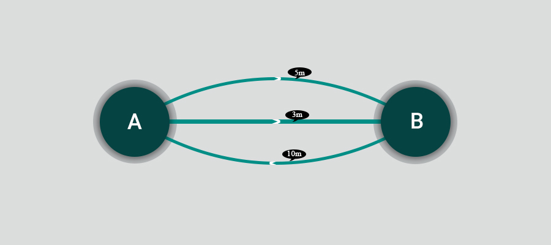

در این فاز ما می‌خواهیم یک حساب را به عنوان یک نود روی بوم گراف وارد کنیم. سپس با
گسترش
این نود، تمامی حساب‌های دیگری که با این حساب تراکنش داشته‌اند را روی صفحه نمایش دهیم.
در واقع قرار است چیزی شبیه به آن چه در زیر مشاهده می‌کنید را پیاده‌سازی کنیم.

برای انجام این فاز مجموعه داده بزرگ‌تری در اختیار شما قرار می‌گیرد تا بتوانید قابلیت جدید را به خوبی تست کنید.  
[Transactions](/datasets/transactions-expansion.zip)

## نمایش یک حساب به عنوان راس گراف

در فاز قبلی ما هر تراکنش را به صورت دمبل نشان می‌دادیم. در این فاز باید بتوانیم در ابتدا یک حساب را به تنهایی به عنوان راس گراف روی صفحه نشان بدهیم. بدین صورت که کاربر بتواند یک شماره حساب را در برنامه جست‌وجو کند و در صورت وجود آن شماره حساب، یک راس گراف که روی آن اسم مالک حساب نوشته شده در صفحه ظاهر شود.

برنامه باید طوری باشد که اگر کاربر به تعداد دلخواه، شماره حساب جست‌وجو کرد، در صورت وجود روی صفحه راس گراف ظاهر شود.
همچنین این ویژگی‌ که با کلیک روی راس، اطلاعات حساب نمایش داده شود باید وجود داشته‌باشد.

## قابلیت کلیک راست روی راس

بعد از این که کاربر یک شماره حساب را جست‌وجو کرد و راس گراف روی صفحه نمایش داده شد، باید ویژگی‌ای را در نظر بگیرید که کاربر بتواند روی آن کلیک راست کند و لیست حاوی سه گزینه‌ نمایان شود.

1. پاک کردن راس
2. گسترش دادن راس

## گسترش راس

ما تا این بخش، به کاربر استفاده کننده از نرم‌افزار این توانایی را داده‌ایم که یک شماره حساب را جست‌وجو کند، آن را به عنوان یک راس روی صفحه بیندازد، روی آن راست کلیک کند و لیستی حاوی سه گزینه نمایان شود.

با انتخاب گزینه گسترش، باید تمامی حساب‌هایی که در پایگاه داده ما با حساب موجود روی صفحه تراکنش داشتند، به همراه یال تراکنش‌ بین آن‌ها، روی صفحه نشان داده شود. یال تراکنش باید جهت‌دار باشد و جهت آن از حساب مبدا به حساب مقصد باشد. همچنین میزان مبلغ تراکنش روی یال بین آن‌ها نوشته شود.

در این زیر شما بخشی از پرتال تحلیل روابط ستاره را مشاهد‌ه می‌کنید که کاربر با راست کلیک کردن روی یک راس، می‌تواند آن را گسترش دهد.

## چالش‌های پیاده‌سازی گسترش راس‌ها

به طور پیش‌فرض برای پیاده‌سازی این بخش، باید در پایگاه‌ داده تمامی تراکنش‌هایی را که حساب مورد نظر در آن‌ها حضور داشتند پیداکنیم و دمبل تراکنش‌ بین‌ آن‌ها را تشکیل‌دهیم. با این کار مثلا اگر حساب موردنظر 90 تراکنش انجام‌شده در پایگاه داده داشته باشد، 90 دمبل روی صفحه ایجاد می‌شود که نتیجه‌ی جالبی نیست و به درد تحلیل‌گر نمی‌خورد. برای این کار ما باید تمامی دنبل‌هایی را که یک سرشان حساب موردنظر است، ادغام
(Merge)
کنیم تا چیزی شبیه تصویر اول داک به وجود بیاید.

به تصویر زیر دقت‌کنید:

در پروژه ما فقط باید گراف ادغام شده را به کاربر نشان بدهیم و مرحله ادغام شدن در این تصویر برای فهم بهتر است. نتیجه‌ای که به کاربر نشان داده می‌شود باید شبیه گیف موجود در اول داک باشد.

اما چگونه باید ادغام را پیاده‌سازی کنیم؟

برای این کار کافی است راس‌هایی را که دقیقا تکرار شده‌ی راس اولیه بوده‌اند، یعنی نمایان‌گر یک حساب واحدند تبدیل به یک راس کنیم و بقیه راس‌های موجود در نتیجه جست‌‌و‌جو را به آن متصل کنیم. برای شناسایی این که کدام راس‌ها یکی هستند، باید آن‌ها را از طریق شماره حساب شناسایی کنیم. شماره حساب در این پروژه برای هر حساب مجزا، عددی واحد در نظر گرفته شده‌ است.

علاوه بر این، وقتی قرار است تراکنش‌های انجام‌شده توسط یک حساب را رسم کنیم، حالت خاص دیگری به وجود می‌آید که حساب مورد نظر ما با یک حساب خاص، چند تراکنش داشته باشد.
برای این حالت‌هامی‌توانید یال‌های انحناداری بین دو راس ایجاد کنید:

