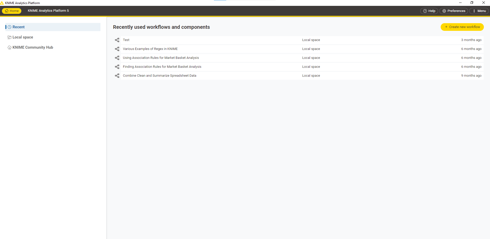
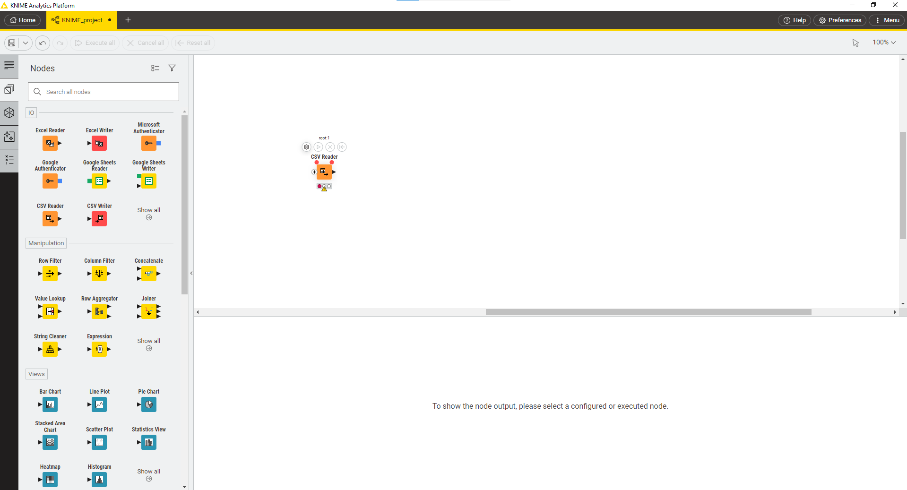
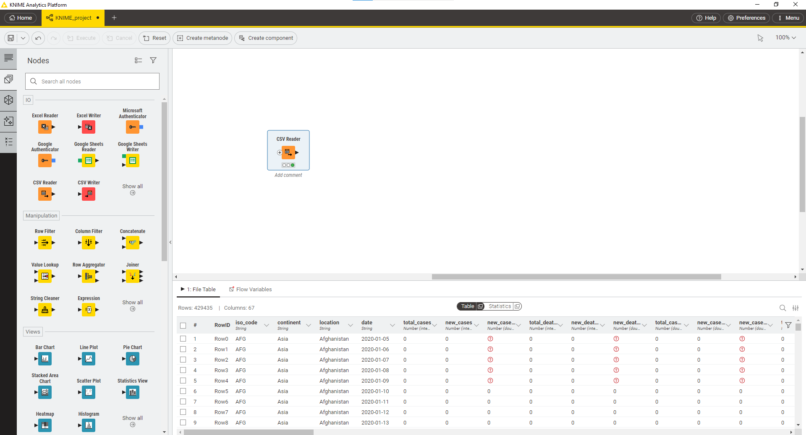
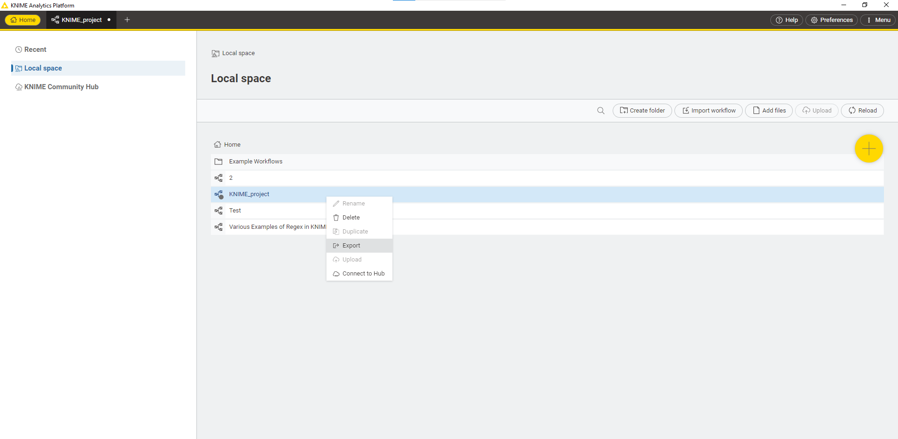

## مقدمه

در دنیای واقعی، داده‌ها از منابع مختلف و با استانداردها و ساختارهای گوناگون جمع‌آوری می‌شوند. همچنین، در بسیاری از
موارد،
داده‌ها تمیز نیستند و باید پیش از استفاده، فرآیند تمیزسازی روی آن‌ها انجام شود. حال فرض کنید می‌خواهیم داده‌های مربوط به
یک موضوع را که از منابع مختلف جمع‌آوری شده‌اند و ساختارهای متفاوتی دارند، مورد پردازش قرار دهیم و به نتیجه‌ی دلخواه
برسیم. برای این کار، باید همه‌ی داده‌ها را تمیز کنیم و آن‌ها را به یک ساختار و استاندارد یکسان درآوریم.

## تعریف ETL

به فرآیند کپی داده از یک یا چندین منبع به یک سیستم مقصد که داده را به طور متفاوتی بازنمایی می‌کند،
ETL
گفته می‌شود.
[(ویکی‌پدیا)](https://en.wikipedia.org/wiki/Extract,_transform,_load)

عبارت
**ETL**
متشکل از سه واژه‌ی زیر است که در ادامه به توضیح هر یک می‌پردازیم:

* Extract
* Transform
* Load

### Data Extraction (استخراج داده)

در این مرحله، داده‌ی خام از منابع مختلف به یک فضای میانی کپی می‌شود. منابع مبدأ می‌توانند دارای داده‌ی ساختاریافته یا
غیرساختاریافته باشند. از منابع داده می‌توان به موارد زیر اشاره کرد:

* SQL or NoSQL Databases
* Flat files
* Email
* Web pages
* etc.

### Data Transformation (تبدیل داده)

داده‌ی خام موجود، در فضای میانی مورد پردازش قرار می‌گیرد تا به ساختاری که برای تحلیل داده مورد نیاز است تبدیل شوند. این
مرحله می‌تواند شامل کارهای زیر باشد:

* فیلتر کردن
* تمیزسازی
* حذف داده‌های تکراری
* اعتبارسنجی
* انجام محاسبات، ترجمه و یا خلاصه‌سازی داده‌ی خام که می‌تواند شامل تغییر نام ستون‌ها، تبدیل واحدهای پول یا واحدهای
  اندازه‌گیری، ویرایش ستون‌های متنی یا ... باشد.
* حذف یا رمزنگاری داده‌های حساس یا محرمانه
* تبدیل ساختار داده به ساختار مقصد، مثلاً تبدیل
  JSON
  به یک جدول یا چند جدول که می‌توان آن‌ها را
  Join
  کرد.

### Data Loading (بارگذاری داده)

در این مرحله، داده‌ی تبدیل‌شده در مرحله‌ی قبل از فضای میانی به انباره‌ی داده‌ی مقصد منتقل می‌شود. این مرحله معمولاً غیر
از بارگذاری اولیه‌ی داده، به صورت متناوب نیز اجرا می‌شود تا داده‌های جدید به انباره‌ی داده اضافه شوند. در اکثر موارد این
فرآیند به طور اتوماتیک انجام می‌شود.

برای آشنایی بیش‌تر، مطالعه‌ی لینک‌های زیر توصیه می‌شود:

[https://www.ibm.com/cloud/learn/etl](https://www.ibm.com/cloud/learn/etl)

[https://www.guru99.com/etl-extract-load-process.html](https://www.guru99.com/etl-extract-load-process.html)

## دست‌گرمی

برای آشنایی بیش‌تر، دست‌گرمی‌ای برای شما در نظر گرفته شده است تا بتوانید کمی مزه‌ی
ETL
را بچشید.

### دانلود

وارد وبسایت
[Knime](https://www.knime.com/)
شوید و برنامه
Knime
را با توجه به سیستم عامل خود، دانلود کنید.

### ساخت workflow

پس از نصب، وارد برنامه شوید و در قسمت زیر، یک
workflow
جدید بسازید:

برای
workflow
خود نام مشخص کنید و
سپس فایل
[owid-covid-data.csv](https://github.com/owid/covid-19-data/blob/master/public/data/owid-covid-data.csv)
را برای مرحله بعد دانلود کنید.

### استفاده از جعبه ابزار

سمت چپ، قسمت
Nodes،
جعبه ابزار شما برای استفاده و توسعه
workflow
است.
برای مثال،
Node
خواندن
CSV
را بر روی صفحه اضافه کنید و سعی کنید فایل‌ دانلود شده در مرحله قبل را بخوانید.

:::tip
با توجه به مقدار سطر‌های فایل‌، نیاز است در تنظیمات
Node
‌ذکر شده، به قسمت
Advanced Settings
بروید
و در زیربخش
Table specification،
گزینه
Limit data rows scanned
را غیر فعال کنید و مجدد
Node
را اجرا کنید.
:::

پس از اجرای موفق،
Node
به شکل زیر در می‌آید:

### فیلتر داده‌ها

با استفاده از
Node
های جعبه ابزار مانند
Row Filter،
داده‌های مربوط به کشور ایران را فیلتر نمایید.

### تمیزسازی

مراحل زیر را برای تمیزسازی داده انجام دهید:

1. قسمت اعشاری ستون‌های
   `new_cases`
   و
   `new_deaths`
   را حذف نمایید.

2. مقادیر خالی در ستون
   (NaN یا null)
   را در ستون
   `new_vaccinations`
   با مقدار صفر جایگزین نمایید.

3. نوع ستون
   `date`
   را از
   string
   به تایپ
   Date
   تبدیل کنید.

### Aggregation

جمع تعداد موارد ابتلا در هر ماه را محاسبه کنید و در ستونی به نام
`total_month_cases`
بریزید.

:::tip
برای این کار ممکن است لازم باشد ابتدا روی ستون تاریخ تغییراتی انجام دهید.
:::

### Join

[دادگان موقعیت جغرافیایی کشورها](/datasets/world_country_latitude_and_longitude_values.csv)
را آپلود نمایید. سپس با استفاده از
Join
به دادگان آمار مبتلایان ستون‌های طول و عرض جغرافیایی را اضافه نمایید.

### دریافت خروجی

در نهایت جدول خروجی را در قالب یک
csv
خروجی بگیرید و نتایج را مشاهده کنید.

در نهایت
workflow
خود را با تیم‌های دیگر به اشتراک بگذارید
و
workflow
آن‌ها را مشاهده کنید و روش‌های مورد استفاده‌ی
آن‌ها را ببینید چرا که برای انجام یک کار چندین راه وجود دارد.
برای اشتراک گذاری
به تب
Home
بروید و در قسمت
Local space،
بر روی
workflow
خود راست کلیک کنید و آن را
Export
بگیرید و
workflow
بقیه را با دکمه
Import workflow
بارگذاری کنید.

