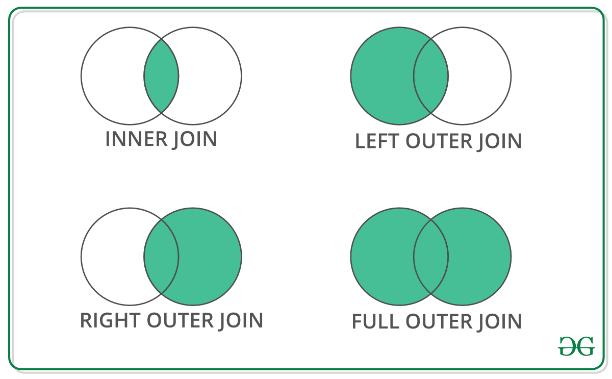
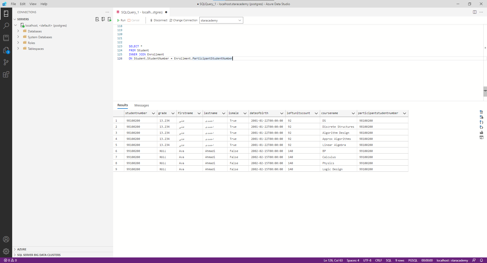
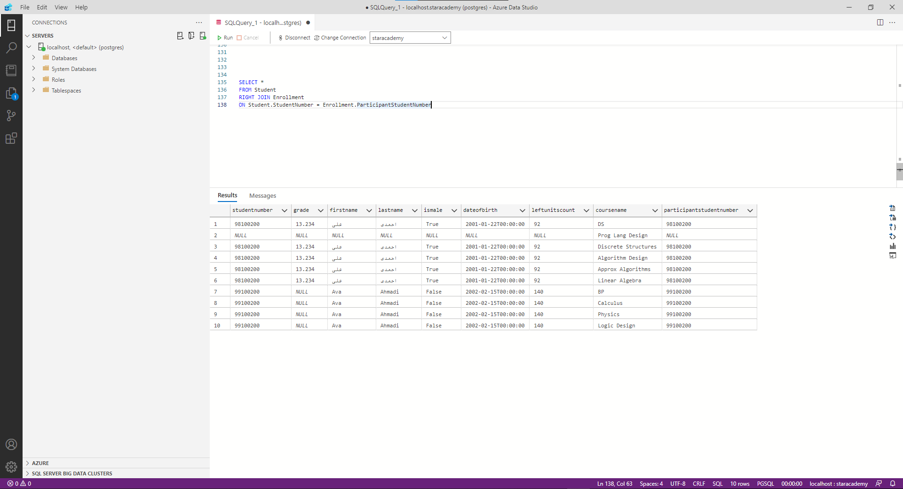
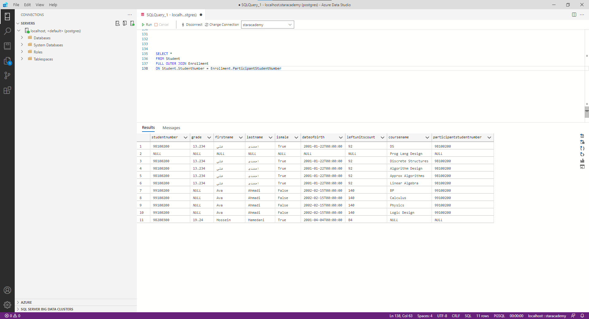

## مقدمه

در این فاز با یک پایگاه داده رابطه‌ای، نحوه‌ی کار کردن با آن و
queryهای آن آشنا می‌شوید.

## پایگاه داده چیست؟

پایگاه داده یا
Database
مجموعه‌ای از داده‌ها است که به صورت ساختارمند درون کامپیوتر نگهداری می‌شوند.
سامانه مدیریت پایگاه داده یا
DBMS(Database Management System)
نرم‌افزاری است که با کاربر نهایی، برنامه‌های کاربردی و خود پایگاه داده برای ذخیره و بازیابی داده تعامل می‌کند.
DBMS
های مختلفی برای کابردهای متفاوت وجود دارند که پرکاربردترین
آن‌ها،
DBMS
های رابطه‌ای یا همان
RDBMS (Relational Database Management System)ها هستند. در این
DBMSها داده‌ها به صورت سازمانمند در جداول ذخیره می‌شوند و مقادیر موجود در هر جدول با یکدیگر ارتباط دارند. به همین خاطر به آن رابطه‌ای با
relational
گفته می‌شود.

از آنجایی که اکثر
RDBMS
ها از زبان پرسمان سازمان‌یافته یا
SQL(Structured Query Language)
استفاده می‌کنند، با آشنایی با یکی از این
RDBMSها می‌توانید با صرف زمان کم نحوه استفاده از یک
RDBMS
جدید را فرابگیرید. همچنین
SQL
جزو استاندارد
ANSI
و
ISO
می‌باشد.

تعداد زیادی RDBMS وجود دارد که بسته به نیاز از آن‌ها استفاده می‌شود.
MySQL, SQL Server, PostgreSQL و SQLite
نمونه‌هایی از
RDBMSهای معروف هستند. در این فاز با PostgreSQL کار می‌کنید که یک DBMS قدرتمند و open source می‌باشد.

## نصب و راه‌اندازی ابزارهای مورد نیاز

### Postgres

برای نصب PostgreSQL به [این لینک](https://www.postgresql.org/download/) مراجعه نمایید. (احتمالاً برای دانلود به ابزار رفع تحریم نیاز پیدا خوهید کرد!)

### Azure Data Studio

Azure Data Studio نرم‌افزاری cross-platform برای مدیریت دیتابیس می‌باشد که
توسط مایکروسافت در سال 2018 به صورت
Open Source
عرضه شد.

جهت نصب ADS و آماده‌سازی آن برای کار با PostgreSQL از [این لینک](https://docs.microsoft.com/en-us/sql/azure-data-studio/quickstart-postgres) استفاده نمایید و سپس مراحل ذکر شده در لینک برای اتصال به Postgres را طی کنید.

پس از آنکه به
Postgres
متصل شدید، صفحه‌ی مربوط به
Connection
نمایان می‌شود که وضعیت سرور را نشان می‌دهد. در این صفحه با انتخاب گزینه
New Query
می‌توانید دستوراتی را به زبان
SQL
به سرور بفرستید و پاسخ خود را دریافت کنید.


پس از نوشتن query با فشردن کلید
F5
یا کلیک بر روی دکمه Run، آن را اجرا کنید. سعی کنید از اینجا به بعد هر دستوری که در داک مشاهده می‌کنید را برای خودتان اجرا نمایید.


## Database در PostgreSQL

یک
Database
در
PostgreSQL
مجموعه‌ای از چند شئ از نوع جدول
(Table)
، رویه ذخیره شده
(Stored Procedure)
، تابع
(Function)
، نما
(View)
و ... است. اگر این عبارات برایتان ناآشنا است نگران نباشید! در ادامه با آن‌ها آشنا می‌شوید. فعلا در این حد بدانید که داده‌ها در
PostgreSQL
باید در یک
Database
وجود داشته باشند.

## ایجاد و حذف Database

همانظور که در تعاریف دیدیم برای کار با داده باید حداقل یک
Database
ایجاد کنیم.

```sql
CREATE DATABASE database_name;
```

برای مثال:

```sql
CREATE DATABASE StarAcademy;
```

با اجرای این دستور، دیتابیس ساخته می‌شود و با
Refresh
کردن
Databases
دیتابیس
StarAcademy
مشاهده می‌شود.

پس از اجرا کردن هر دستور،
ADS
پیغامی متناسب با موفقیت و یا عدم موفقیت
Query
اجرا شده چاپ می‌کند. در صورت مواجه شدن با خطا، پیغام مربوط به خطا نیز چاپ می‌شود که به رفع خطا کمک می‌کند.


برای حذف یک دیتابیس نیز از دستور زیر استفاده می‌شود.

```sql
DROP DATABASE database_name;
```

## Data Type

Data Type،
نوع داده‌ای است که هر ستون در جدول یا متغیر می‌تواند ذخیره کند.
برای آشنایی با Data Typeهای پرکاربرد PostgreSQL از [این لینک](https://www.geeksforgeeks.org/postgresql-data-types/) استفاده کنید. همچنین در صورت نیاز می‌توانید از [مستندات Postgresql.org](https://www.postgresql.org/docs/current/datatype.html) هم بهره ببرید.

## جدول

جدول یا
Table
شئ‌ای است که داده‌ها را به صورت سطر
(Row)
و ستون
(Column)
ذخیره می‌کند.
برای ساختن جدول از دستور زیر استفاده می‌کنیم.

```sql
CREATE TABLE tableName
(
    column_1 datatype [ NULL | NOT NULL ],
    column_2 datatype [ NULL | NOT NULL ],
    ...
);
```

برای مثال جدول دانشجو را به صورت زیر می‌سازیم. با نوشتن
NOT NULL
بعد از تعریف هر ستون، دادن مقدار به آن ستون در هنگام افزودن داده الزامی می‌شود. (در واقع مقدار آن ستون نمی‌تواند NULL باشد)

```sql
CREATE TABLE Student
(
    StudentNumber VARCHAR(8) NOT NULL,
    Grade FLOAT(2),
    FirstName VARCHAR(20) NOT NULL,
    LastName VARCHAR(20) NOT NULL,
    IsMale BOOLEAN NOT NULL,
    DateOfBirth TIMESTAMP NOT NULL,
    LeftUnitsCount INT NOT NULL
);
```

پس از ساختن جدول می‌توانیم با دستور زیر داده‌ی مورد نظر را در جدول قرار دهیم.

```sql
INSERT INTO tableName
(column_1, column_2, ... )
VALUES
(expression_1, expression_2, ... ),
(expression_1, expression_2, ... ),
...;
```

برای مثال با دستور زیر داده متناظر به جدول اضافه می‌شود.

```sql
INSERT INTO Student(FirstName, LastName, DateOfBirth, IsMale, LeftUnitsCount, StudentNumber)
VALUES('Ava', 'Ahmadi', 'Feb 15, 2002', false, 140, '99100200');
```

همچنین با حفظ ترتیب ستون‌ها، می‌توان بدون نیاز به مشخص کردن نام هر ستون، داده را اضافه کرد. مانند دستور زیر:

```sql
INSERT into Student values
(
    '98100200',
    13.234,
    'علی',
    'احمدی',
    true,
    '1/22/2001',
    92
);
```

پس از قرار دادن داده‌ها در جدول، با کوئری زیر می‌توانیم داده ذخیره شده در جدول را دریافت کنیم.

```sql
SELECT column1, column2, ...
FROM tableName
[WHERE condition];
```

برای مثال برای دریافت داده تمام دانشجویانی که اضافه کرده‌ایم، دستور زیر را اجرا می‌کنیم.

```sql
SELECT *
FROM Student;
```

همانطور که مشاهده می‌کنید، به جای نام ستون‌ها از "\*" استفاده شده است. که به معنی همه ستون‌ها می‌باشد. در واقع این دستور با دستور زیر معادل است.

```sql
SELECT StudentNumber, Grade, FirstName, LastName, IsMale,DateOfBirth, LeftUnitsCount
FROM Student;
```

با اجرای دستور بالا،
ADS
داده‌ها را مانند شکل زیر به صورت جدول در
Results Tab
نمایش می‌دهد.


در هر دو صورت خروجی به شکل زیر خواهد بود:


با استفاده از
Operatorها در عبارتی که با
Where
شروع می‌شود، می‌توانیم شروط و محدودیت‌هایی بر روی داده دریافت شده قرار دهیم. برای مثال دستور زیر افرادی که جنسیت آن‌ها مرد و معدلشان بین 10 تا 15 است را نمایش می‌دهد.

```sql
SELECT *
FROM Student
WHERE IsMale = true AND 10 < Grade AND Grade < 15;
```

همان
Query
بالا را به صورت زیر هم می‌توان نوشت.

```sql
SELECT *
FROM Student
WHERE IsMale = true AND Grade BETWEEN 10 AND 15;
```

در هر دو صورت داریم:


در جدول زیر
Operatorهای موجود را مشاهده می‌کنید. همچنین مانند مثال بالا می‌توانید تعدادی از
Cluaseها را با یکدیگر
AND
یا
OR
کنید.

|   Operator   |                     توضیحات                      |               Example                |
| :----------: | :----------------------------------------------: | :----------------------------------: |
|      =       |                      Equal                       |      StudentNumber = '98100200'      |
|  &gt, &gt=   |         Greater than, Greater than equal         |      Grade &gt 15,Grade &gt= 15      |
|  &lt, &lt=   |            Less than, Less than equal            |      Grade &lt 12, Grade &lt=12      |
| &lt&gt or != |                    Not equal                     | IsMale &lt&gt true or IsMale != true |
|   BETWEEN    |             Between a certain range              |       Grade BETWEEN 14 AND 17        |
|     LIKE     |               Search for a pattern               |       StudentNumber LIKE '98%'       |
|      IN      | To specify multiple possible values for a column |   LastName IN ('Ahmadi', 'احمدی')    |

پس از ساختن جدول، با دستورات زیر می‌توانیم ستون‌های آن را ویرایش کنیم.

```sql
ALTER TABLE tableName ADD column1 datatype, column2datatype, ...;
ALTER TABLE tableName DROP COLUMN column1, column2, ...;
ALTER TABLE tableName ALTER COLUMN column1 datatype,column2 datatype, ...;
```

با دستور زیر می‌توانیم یک جدول را حذف کنیم.

```sql
DROP TABLE tableName;
```

همچنین برای حذف داده‌های درون یک جدول و حفظ ساختار جدول از دستور زیر استفاده می‌کنیم.

```sql
DELETE FROM tableName;
```

## کلیدها

### Primary Key

Primary Key
یک ستون یا ترکیبی از ستون‌ها است که یک داده را به صورت منحصر به‌فرد مشخص می‌کند. قوانین زیر بر
Primary Key
حاکم هستند :

1. هر جدول فقط می‌تواند یک Primary Key داشته باشد.
1. تمامی مقادیر موجود برای Primary Key منحصر به‌فرد هستند.
1. DBMS اجازه‌ی اضافه کردن داده‌ای که Primary Key آن از قبل موجود است، را نمی‌دهد.
1. Primary Key نمی‌تواند NULL باشد.

برای ساختن Primary Key می‌توانیم جدولی که از قبل موجود است را با دستور زیر تغییر دهیم.

```sql
ALTER TABLE tableName
ADD CONSTRAINT constraintName PRIMARY KEY (columncolumn_2, ..., column_n);
```

برای مثال جدول Student موجود را به این صورت تغییر می‌دهیم :

```sql
ALTER TABLE Student
ADD CONSTRAINT studentPK PRIMARY KEY (StudentNumber);
```

در واقع
Constraint
برای مشخص کردن قانون برای داده‌های جدول استفاده می‌شود. عبارت
NOT NULL
که قبلا با آن در ساختن جدول آشنا شدید نیز یک
Constraint
است. حال در اینجا دریافتید که
Primary Key
هم
Constraint
است.

همچنین می‌توان PRIMARY KEY را در زمان ساخت جدول مشخص نمود:

```sql
CREATE TABLE Student2
(
    StudentNumber VARCHAR(8) NOT NULL PRIMARY KEY,
    Grade FLOAT(2),
    FirstName VARCHAR(20) NOT NULL,
    LastName VARCHAR(20) NOT NULL,
    IsMale BOOLEAN NOT NULL,
    DateOfBirth TIMESTAMP NOT NULL,
    LeftUnitsCount INT NOT NULL
);
```

### Foreign Key

Foreign Key
کلیدی برای ارتباط جداول است. در واقع
Foreign Key
ستونی است که به
Primary Key
سایر جداول همان پایگاه داده ارجاع می‌دهد. قوانین
Foreign Key
عبارتند از :

1. Foreign Key می‌تواند NULL باشد.
2. جدولی که Foreign Key دارد را فرزند (Child)، و جدولی که به آن ارجاع داده می‌شود را والد (Parent) می‌نامیم.
   برای ایجاد یک
   Foreign Key
   در هنگام ایجاد جدول یا پس از ایجاد آن، یک
   Constraint
   اضافه می‌کنیم.
   برای مثال جدولی جدید برای ثبت‌نام در هر درس می‌سازیم. در این جدول نام درس و شماره دانشجویی فرد ثبت‌نام شده را به صورت
   Foreign Key
   نگه می‌داریم. برای ساختن این جدول از دستور زیر استفاده می‌کنیم.

```sql
CREATE TABLE Enrollment
(
    CourseName VARCHAR(20),
    ParticipantStudentNumber VARCHAR(8),
    CONSTRAINT studentNumberFK FOREIGN KEY (ParticipantStudentNumber)
    REFERENCES Student(StudentNumber)
);
```

حال رفتار
Foreign Key
را با افزودن 3 داده جدید بررسی می‌کنیم.

```sql
INSERT INTO Enrollment VALUES
('Data Structures', '98100200');
```

```sql
INSERT INTO Enrollment VALUES
('Advance Programming', NULL);
```

```sql
INSERT INTO Enrollment VALUES
('Advance Programming', '97100200');
```


همانطور که در تصویر مشاهده می‌کنید، دستور اول که مقدار
Foreign Key
آن در جدول
Student
موجود بود و دستور دوم که
Foreign Key
در آن
NULL
بود با موفقیت اجرا شده‌اند. اما دستور سوم که
Foreign Key
آن در جدول
Student
موجود نبود با خطا مواجه شده است.

## Joins

Joinها از مهم‌ترین دستورات
SQL
تلقی می‌شوند. با استفاده از
Joinها می‌توانیم داده را از چند جدول به کمک
Key
و با یک دستور دریافت کنیم. در
SQL
چهار نوع
Join
وجود دارد که مشاهده عملکرد هر یک از آن‌ها در نمودار
Venn
راحت‌تر است. پس شکل زیر را به دقت بررسی کنید.


حال نمونه‌ی هر
Join
را در دستورات زیر مشاهده می‌کنید. مقادیر اولیه جدول
Enrollment (Child)
و
Student (Parent)
نیز در ابتدا نشان داده شده است.







## تابع‌ها

SQL
توابع زیادی برای انجام محاسبات بر روی داده‌ها دارد که به صورت کلی در دو دسته قرار می‌گیرند.

### Aggregate Functions

ورودی تابع، مقادیر موجود در جدول می‌باشد. چند نمونه از این توابع را در زیر مشاهده می‌کنید.

- [AVG](http://www-db.deis.unibo.it/courses/TW/DOCS/w3schools/sql/sql_func_avg.asp.html)
- [COUNT](http://www-db.deis.unibo.it/courses/TW/DOCS/w3schools/sql/sql_func_count.asp.html)
- [MIN](http://www-db.deis.unibo.it/courses/TW/DOCS/w3schools/sql/sql_func_min.asp.html)

### Scalar Functions

ورودی تابع، در زمان صدا زدن به آن داده می‌شود. چند نمونه از این توابع نیز در ادامه آمده است.

- [ROUND](http://www-db.deis.unibo.it/courses/TW/DOCS/w3schools/sql/sql_func_round.asp.html)
- [SUBSTRING](https://www.guru99.com/sql-server-substring.html)

## **GROUP BY**

```sql
SELECT column_name, aggregate_function(column_name)
FROM table_name
WHERE column_name operator value
GROUP BY column_name;
```

با استفاده از دستور
GROUP BY
می‌توان ستون‌ها را دسته‌بندی کرد. این دستور با
Aggregate Funcitons
به کار می‌رود. برای مثال دستور زیر تعداد آقایان و خانم‌ها را خروجی می‌دهد.

```sql
SELECT IsMale, COUNT(IsMale) FROM Student GROUP BY IsMale;
```

دستور زیر تعداد دروس ثبت‌نامی هر دانشجو را نشان می‌دهد.

```sql
SELECT ParticipantStudentNumber, COUNT(ParticipantStudentNumber)
FROM Enrollment
GROUP BY ParticipantStudentNumber;
```
