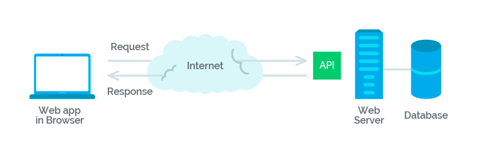

## مقدمه

در این فاز با فریم‌ورک `ASP.NET Core`
آشنا خواهید شد.

برای آشنایی با تاریخچه و دلیل محبویت وب و مزایای آن نسبت به مدل‌های قدیمی ارتباط client-server
مقاله [From History of Web Application Development](https://www.devsaran.com/blog/history-web-application-development)
را مطالعه کنید.

## مفاهیم اولیه

قبل از آنکه به سراغ ASP.NET Core
برویم بهتر است به مفاهیم `Http`
و `Rest`
پرداخته شود.

### Http چیست؟

پروتکل HTTP
مخفف عبارت `Hyper Text Transfer Protocol`
است و به ارتباط میان سرویس‌دهنده (server)
و سرویس‌گیرنده (client)
در وب می‌پردازد.

ارتباط بین clientها
و serverها
از طریق ارسال درخواست‌های http
و دریافت پاسخ‌های http
انجام می‌شود.
به زبان ساده‌تر، http
یک نوع قانون است که ارسال و دریافت اطلاعات بین client
و server
بر اساس آن انجام می‌شود.

:::tip ‌
برای آشنایی بهتر با Http
می‌توانید از لینک‌های زیر کمک بگیرید:

- [An overview of HTTP](https://developer.mozilla.org/en-US/docs/Web/HTTP/Overview)
- [Hypertext Transfer Protocol (HTTP)](https://www.extrahop.com/resources/protocols/http/)
:::

### RESTful Api

`API`
یا `Application Programming Interface`
(که به رابط برنامه‌نویسی کاربردی ترجمه می‌شود) مجموعه‌ای از قواعد و مکانیزم‌ها است که از طریق آن نرم‌افزارها و یا کامپوننت‌های مختلف یک برنامه با همدیگر ارتباط برقرار می‌کنند. منظور از رابط چیزی‌ است که دو شئ یا دو موجودیت مختلف را به همدیگر ربط می‌دهد. API
می‌تواند داده‌هایی که شما برای نرم‌افزارتان نیاز دارید را از طریق یک فرمت مناسب به خروجی بفرستد و یا آن‌ را برگشت دهد. فرمت JSON
و XML
از این دست فرمت‌ها هستند. در این مطلب ما قصد داریم روی JSON
تمرکز کنیم.



برای آشنایی بیشتر با `RESTful api`
لینک‌های زیر را مطالعه کنید.

- [Learn REST: A RESTful Tutorial](https://www.restapitutorial.com/)
- [RESTful API به زبان ساده چیست؟](https://roocket.ir/articles/a-beginners-tutorial-for-understanding-restful-api)
- [What Is a REST API?](https://www.sitepoint.com/developers-rest-api/)

## سلام به دنیای ASP.NET Core

ASP.NET Core
یک چارچوب به زبان #C
است که به وسیله آن می‌توانید یک سرور `RESTful api`
راه‌اندازی کنید.

برای ساخت یک پروژه ASP.NET Core
کافی است در ترمینال دستور زیر را وارد کنید:

```powershell
dotnet new webapi
```

برای اجرا شدن اولین پروژه ASP.NET Core
خود در ترمینال دستور زیر  را وارد کنید:

```powershell
dotnet run
```

:::note ‌
پیش از اجرای برنامه خود برای اولین بار دستور `dotnet dev-certs https --trust`
را در ترمینال اجرا کنید.
:::

حال برای مشاهده خروجی کار آدرس `https://localhost:<app port>/WeatherForecast`
را در مرورگر خود باز کنید.

همانگونه که مشاهده می‌کنید در خروجی یک لیست از داده‌های آب و هوایی وجود دارد که در پروژه پیش فرض ASP.NET Core
تعریف شده است.

:::tip ‌
برای مشاهده لیست APIها
و مطالعه مستنداتی ساده درباره هر API
می‌توانید آدرس `https://localhost:<appPort>/swagger`
را در مرورگر باز کنید.
:::

### Controller و Action Method

در یک پروژه ASP.NET Core
درخواست‌های رسیده به سایت یا `Web Application`
توسط کنترلرها پاسخ داده می‌شوند. پس به زبان خیلی ساده، کنترلرها به درخواست‌هایی که توسط کاربران ارسال می‌شوند پاسخ می‌دهند. کنترلرها کلاس‌هایی هستند که در فولدر `Controllers`
قرار دارند. این کلاس‌ها با کلمه Controller
به اتمام می‌رسند و از کلاس `Controller`
یا `ControllerBase`
ارث بری می‌کنند.

هر متدی با دسترسی عمومی (Public)
در کنترلر، به عنوان یک متد عملیاتی (Action Method)
شناخته می‌شود، پس به متدهایی که درون کلاس کنترلر تعریف می‌کنیم اکشن متد گفته می‌شود. هر درخواست کاربر به اکشن متد مربوطه ارسال می‌شود و اکشن متد به درخواست کاربر پاسخ می‌دهد.

### ساخت یک کنترلر ساده

در فولدر `Controllers`
خود یک فایل به نام `SimpleController`
ایجاد کنید و کدهای زیر را درون آن قرار دهید.

```CSharp
using Microsoft.AspNetCore.Mvc;

namespace Example.Controllers
{
    [ApiController]
    [Route("[controller]/[Action]")]
    public class SimpleController : ControllerBase
    {
        [HttpGet]
        public string Get()
        {
            return "Hello world!";
        }
    }
}
```

در کد بالا شما یک کنترلر به نام Simple
ساختید که یک اکشن متد به نام Get
دارد. مسیر دسترسی به آن را هم به صورتی تعریف شده که برای دسترسی به آن ابتدا باید نام کنترلر و سپس نام اکشن متد بیاید. برای تست کد خود لینک `https://localhost:<appPort>/Simple/Get`
را باز کنید و خروجی آن را مشاهده کنید.

### خروجی اکشتن متدها

در ASP.NET Core
خروجی اکشن‌ها به سه صورت می‌تواند باشد:

- `Specific type`
- `IActionResult`
- `ActionResult<T>`

برای آشنایی بیشتر با این نوع خروجی‌ها [Controller action return types in ASP.NET Core web API](https://docs.microsoft.com/en-us/aspnet/core/web-api/action-return-types)
را مطالعه کنید.

### Routing

برای مسیردهی در Asp.net core
از دو روش می‌توان این کار را انجام داد. یکی ست کردن تنظیمات در فایل `Program.cs`
و دیگری استفاده از اتریبیوت Route.
برای آشنایی بیشتر با این موضوع لینک‌های زیر را مطالعه کنید:

- [Routing to controller actions in ASP.NET Core](https://docs.microsoft.com/en-us/aspnet/core/mvc/controllers/routing)
- [Routing in ASP.NET Core MVC](https://code-maze.com/routing-asp-net-core-mvc/)
- [بررسی و فهم مسیرها](https://mizfa.com/blog/routing-core-mvc/)

### Dependency Injection

تزریق وابستگی یا (Dependency Injection)
فرآیندی می‌باشد که در آن وابستگی‌های ما به یک کلاس با استفاده از یک رابط کاربری (یا همان  Interface)
حذف می شود. در ASP.NET Core
به صورت پیش فرض این امکان به ما داده شده است که بتوانیم بدون نیاز به درگیری با مورد خاصی از این ویژگی استفاده کنیم.

برای یادگیری و درک بهتر این موضوع لینک‌های زیر را مطالعه کنید:

- [Dependency injection in ASP.NET Core](https://docs.microsoft.com/en-us/aspnet/core/fundamentals/dependency-injection)
- [ASP.NET Core - Dependency Injection](https://www.tutorialsteacher.com/core/dependency-injection-in-aspnet-core)

### Http Methods

با استفاده از اتریبیوت‌های Http Methods
شما می‌توانید مشخص کنید اکشن شما با استفاده از کدام Http method
صدا شود.

درک بهتر لینک‌های زیر را مطالعه کنید:

- [Using HTTP Methods (GET, POST, PUT, etc.) in Web API](https://exceptionnotfound.net/using-http-methods-correctly-in-asp-net-web-api/)
- [Attribute Routing, HTTP Request Methods & Best Practices in .NET Core Web API](https://dev.to/_patrickgod/net-core-3-1-web-api-entity-framework-jumpstart-part-2-58gp)

### Parameter Binding

در ASP.NET Core
برای گرفتن محتویات درخواست Http
به آرگومان‌های ورودی اکشن از Parameter Binding
کمک می‌گیریم. به وسیله این مفهوم مشخص می‌کنیم داده از Body
یا قسمت‌های دیگر ریکوئست خوانده شود.

برای آشنایی بیشتر با این مفهوم لینک‌های زیر را مطالعه کنید:

- [Parameter Binding in ASP.NET Web API](https://docs.microsoft.com/en-us/aspnet/web-api/overview/formats-and-model-binding/parameter-binding-in-aspnet-web-api)
- [Understand parameter binding in ASP.Net Web API](https://www.infoworld.com/article/3133728/understand-parameter-binding-in-aspnet-web-api.html)

### Configuration

در ASP.NET Core
تنظیمات برنامه می‌تواند از منابع مختلفی بیاید. یکی از پرکاربرد‌ترین آن‌ها فایل است. تغییر تنظیمات ذخیره شده در فایل نیاز به `Build`
مجدد ندارد. از این رو استفاده از آن متداول است. با استفاده از لینک‌های زیر با این فایل‌ها در ASP.NET Core
آشنا شوید و تفاوت فایل‌های `launchSetting.json`،
`appsetting.json`
و `appsetting.{Environment}.json`
را درک کنید. (`{Environment}`
محیط کنونی برنامه است که مقدار آن می‌تواند `Development`،
`Staging`
یا `Production`
باشد)

- [ASP.NET Core launchSettings.json file](https://dotnettutorials.net/lesson/asp-net-core-launchsettings-json-file/)
- [ASP.NET Core appsettings.json file](https://dotnettutorials.net/lesson/asp-net-core-appsettings-json-file/)

:::note ‌
در لینک‌های بالا مطالعه بخش‌های مربوط به `Visual Studio`
نیاز نیست.
:::

## Postman

Postman
یک افزونه گوگل کروم است که با استفاده از آن می‌شود به راحتی متدهای یک Web API
را اجرا، تست یا بررسی کرد.

این ابزار به ما کمک می‌کند تا به سرعت یک درخواست HTTP
ایجاد و ارسال کنیم.

ذخیره درخواست‌ها برای استفاده‌های بعدی، تجزیه و تحلیل پاسخ‌ها، تغییر سریع محتوای یک درخواست، احراز هویت کاربر با ارسال اطلاعات، سفارشی کردن و... از امکانات خوب این افزونه است که باعث می‌شود در هنگام توسعه یک API
زمان بسیار زیادی را صرفه جویی کنید.

Postman
ابزاری بسیار سبک بر مبنای وب است که از آن برای تست کردن سایر API ها
استفاده می شود. کاربرد این ابزار زمانی مشهود است که برنامه نویس قبل از استفاده از یک مدل API
آن را با Postman
بررسی کند. درخواست‌های API
(حتی درخواست‌های پیچیده) را می‌توان با Postman
به راحتی ایجاد کرد و جواب آن‌ها را به شکل‌ها و فرمت‌های مختلف در مرورگر دریافت نمود. همین کارایی باعث می‌شود که برنامه‌نویس بداند API
مورد نظرش چگونه رفتار می کند و در تصمیم‌گیری برای استفاده از آن راحت‌تر باشد.
:::note ‌
برای نصب این نرم‌افزار می‌توانید آن را از سایت رسمی [Postman](https://www.postman.com/downloads/)
دانلود کنید.
:::
:::tip ‌
برای آشنایی بیشتر با این نرم‌افزار می‌توانید [Postman Tutorial for Beginners with API Testing Example](https://www.guru99.com/postman-tutorial.html)
را مطالعه کنید.
:::

## پروژه

برای پروژه‌ی جستجو که کوئری را از طریق کنسول دریافت می‌کرد یک API
بنویسید که نتایج جستجو را در جواب API
برگرداند.

## پینوشت

جهت آشنایی با ASP.NET Core Web API
می‌توانید از ویدئوهای آموزشی [Web APIs for Beginners](https://www.youtube.com/watch?list=PLdo4fOcmZ0oVjOKgzsWqdFVvzGL2_d72v&v=h0KG8OKKgKs)
مایکروسافت نیز استفاده کنید.
