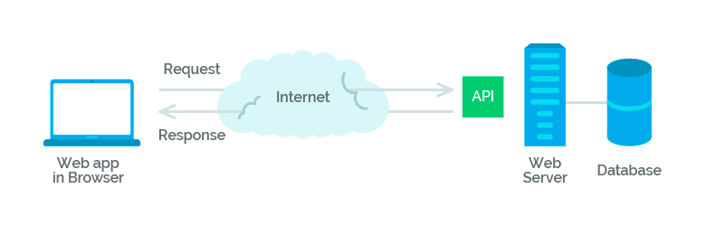

## مقدمه

در این فاز با مفاهیم اولیه شبکه
و پروتکل‌های مهمی که
در ارتباطات شبکه‌ای نقش دارند آشنا خواهید شد.
شبکه‌ها ابزارهای قدرتمندی برای ارتباط
و تبادل اطلاعات بین دستگاه‌ها و سیستم‌ها فراهم می‌کنند
و پایه و اساس اینترنت
و بسیاری از فناوری‌های مدرن را تشکیل می‌دهند.

## مفاهیم اولیه

### شبکه چیست؟

شبکه مجموعه‌ای از دستگاه‌ها است
که به وسیله‌ی اتصالات فیزیکی یا بی‌سیم
به یکدیگر متصل شده‌اند
و می‌توانند اطلاعات را بین خود تبادل کنند.
شبکه‌ها می‌توانند کوچک مانند یک شبکه خانگی
یا بزرگ مانند اینترنت باشند.

### پروتکل چیست؟

پروتکل‌ها مجموعه‌ای از قوانین و استانداردها هستند
که چگونگی ارتباط و تبادل اطلاعات
بین دستگاه‌های شبکه را تعیین می‌کنند.
پروتکل‌ها تضمین می‌کنند که دستگاه‌های مختلف
بتوانند به صورت هماهنگ و بدون مشکل
با یکدیگر ارتباط برقرار کنند.

## پروتکل‌های شبکه

### Http

پروتکل HTTP
مخفف عبارت `Hyper Text Transfer Protocol`
است و به ارتباط میان سرویس‌دهنده (server)
و سرویس‌گیرنده (client)
در وب می‌پردازد.

ارتباط بین clientها
و serverها
از طریق ارسال درخواست‌های http
و دریافت پاسخ‌های http
انجام می‌شود.
به زبان ساده‌تر، http
یک نوع قانون است که ارسال و دریافت اطلاعات بین client
و server
بر اساس آن انجام می‌شود.

:::tip ‌
برای آشنایی بهتر با Http
می‌توانید از لینک‌های زیر کمک بگیرید

- [An overview of HTTP](https://developer.mozilla.org/en-US/docs/Web/HTTP/Overview)
- [Hypertext Transfer Protocol (HTTP)](https://www.extrahop.com/resources/protocols/http/)
:::

- تفاوت بین httpو https چیست؟
### RESTful Api

`API`
یا `Application Programming Interface`
(که به رابط برنامه‌نویسی کاربردی ترجمه می‌شود) مجموعه‌ای از قواعد و مکانیزم‌ها است که از طریق آن نرم‌افزارها و یا کامپوننت‌های مختلف یک برنامه با همدیگر ارتباط برقرار می‌کنند. منظور از رابط چیزی‌ است که دو شئ یا دو موجودیت مختلف را به همدیگر ربط می‌دهد. API
می‌تواند داده‌هایی که شما برای نرم‌افزارتان نیاز دارید را از طریق یک فرمت مناسب به خروجی بفرستد و یا آن‌ را برگشت دهد. فرمت JSON
و XML
از این دست فرمت‌ها هستند. در این مطلب ما قصد داریم روی JSON
تمرکز کنیم.

برای آشنایی بیشتر با `RESTful api`
لینک‌های زیر را مطالعه کنید.

- [Learn REST: A RESTful Tutorial](https://www.restapitutorial.com/)
- [RESTful API به زبان ساده چیست؟](https://roocket.ir/articles/a-beginners-tutorial-for-understanding-restful-api)
- [What Is a REST API?](https://www.sitepoint.com/developers-rest-api/)

## پروتکل‌های مهم دیگر

### TCP/IP

TCP/IP
مجموعه‌ای از پروتکل‌ها است
که اساس ارتباطات اینترنت را تشکیل می‌دهد.
`TCP (Transmission Control Protocol)`
تضمین می‌کند که داده‌ها به درستی
و به ترتیب به مقصد می‌رسند،
در حالی که
`IP (Internet Protocol)`
آدرس‌دهی و مسیریابی داده‌ها را بر عهده دارد.

لینک‌های مطالعه: 

- [TCP/IP](https://www.techtarget.com/searchnetworking/definition/TCP-IP#:~:text=TCP%2FIP%20stands%20for%20Transmission,%2D%2D%20an%20intranet%20or%20extranet.)
- [TCP IP Protocol](https://www.youtube.com/watch?v=2QGgEk20RXM&ab_channel=TechTerms)

### UDP/IP

یا
User Datagram Protocol
یک پروتکل ارتباطی جایگزین برای پروتکل 
TCP
است که در درجه اول برای برقراری اتصالات کم‌زمان که از دست رفتن بسته‌ها می‌تواند اهمیتی نداشته باشد، در بستر اینترنت استفاده می‌شود. سربار حاصل در این پروتکل بسیار کمتر از 
TCP
بوده سرعت بالاتری نیز دارد. 

لینک‌های مربوط:
- [What is the User Datagram Protocol (UDP/IP)?](https://www.cloudflare.com/learning/ddos/glossary/user-datagram-protocol-udp/)
- [TCP vs UDP](https://www.youtube.com/watch?v=jE_FcgpQ7Co&ab_channel=PracticalNetworking)

  
### FTP

`FTP`
یا `File Transfer Protocol`
برای انتقال فایل‌ها بین دستگاه‌ها در یک شبکه استفاده می‌شود. این پروتکل امکان ارسال و دریافت فایل‌ها را به صورت کارآمد و امن فراهم می‌کند.

## ابزارهای تست و توسعه شبکه

### Wireshark

Wireshark
یک ابزار تجزیه و تحلیل پروتکل شبکه است 
که به کاربران اجازه می‌دهد ترافیک شبکه را مشاهده و بررسی کنند.
وایرشارک بسته‌های داده‌ای را که در شبکه در حال حرکت هستند، دریافت می‌کند. 
این بسته‌ها حاوی اطلاعات مختلفی مانند منبع و مقصد آدرس‌های IP، 
پروتکل‌ها و شماره پورت‌های مختلف و داده‌های واقعی ارسال شده از طریق شبکه هستند. 
Wireshark 
داده‌ها را جمع‌آوری کرده 
و به شکل قابل خواندن توسط انسان ارائه می‌دهد.

### Postman

Postman
یک ابزار قدرتمند برای تست و توسعه APIها است.
با استفاده از Postman
می‌توانید درخواست‌های HTTP ایجاد کنید،
آن‌ها را ارسال و پاسخ‌های دریافتی را تجزیه و تحلیل کنید.

:::note ‌
برای نصب این نرم‌افزار می‌توانید آن را از سایت رسمی [Postman](https://www.postman.com/downloads/)
دانلود کنید.
:::
:::tip ‌
برای آشنایی بیشتر با این نرم‌افزار می‌توانید [Postman Tutorial for Beginners with API Testing Example](https://www.guru99.com/postman-tutorial.html)
را مطالعه کنید.
:::
